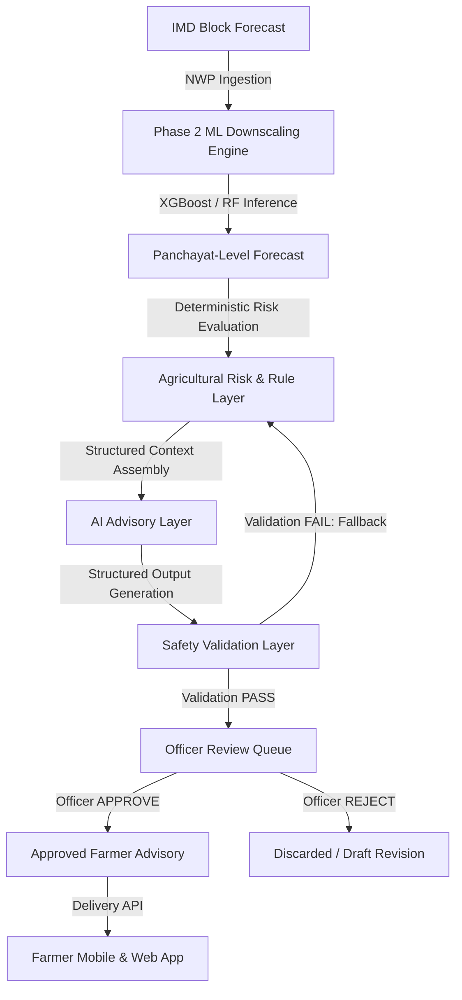
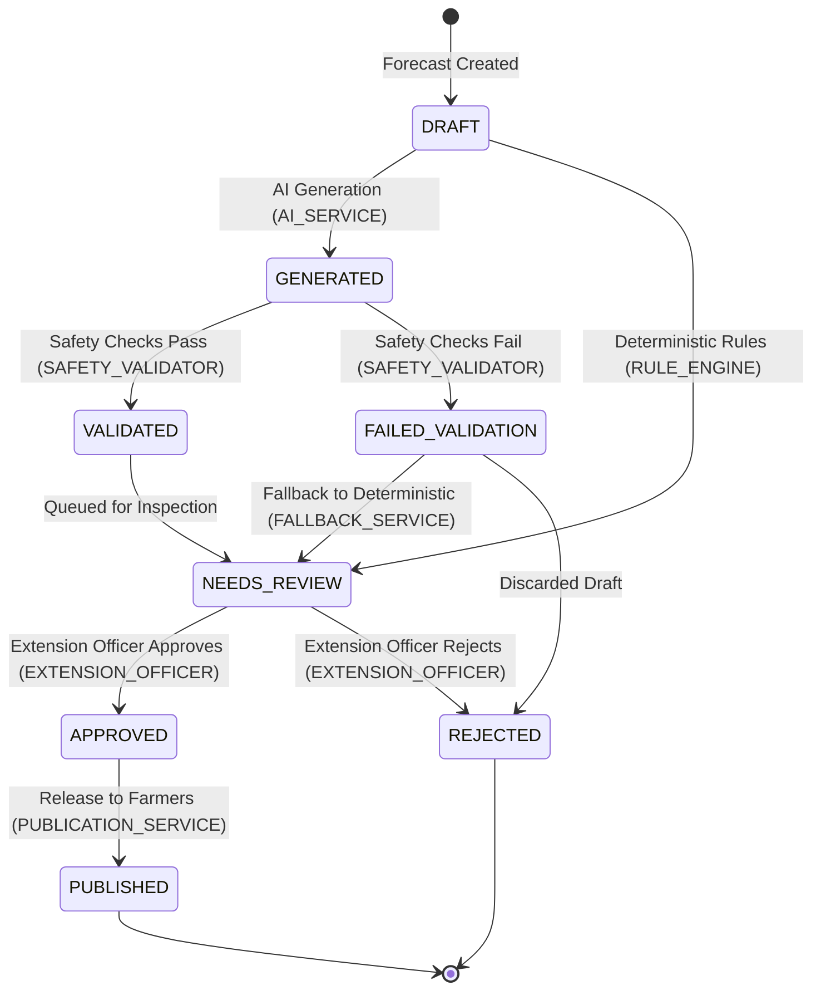

# Phase 5 Weather Intelligence + Agricultural Advisory System Architecture & Data Contracts

**Status:** Architecture & Contracts Defined  
**Scope:** GramSevak Backend (`backend.app.schemas.advisory_contracts`, `src.advisory.lifecycle`, `src.advisory.safety_rules`, `src.advisory.context_builder`)  
**Pipeline:** IMD Block Forecast → Panchayat-Level Downscaling → Panchayat Forecast → Deterministic Risk/Rule Layer → AI Advisory → Safety Validation → Officer Review → Approved Farmer Advisory

---

## 1. Target Pipeline Overview

---

## 2. Layer Responsibilities & Invariants

| Layer | Primary Responsibility | Enforced System Invariants |
| :--- | :--- | :--- |
| **A. Weather Forecast Layer** | Numerical weather prediction downscaled to Panchayat level. | **ML owns numerical weather prediction.** AI must never modify, adjust, or invent numerical weather predictions. |
| **B. Panchayat Context Layer** | Administrative spatial metadata (`panchayats`, `blocks`, `districts` via `HierarchyRepository`). | Spatial hierarchy is the single source of truth for IDs, LGD codes, coordinates, and elevation. |
| **C. Agricultural Risk/Rule Layer** | Evaluates weather variables against deterministic agronomic thresholds. | **Rules own deterministic agricultural risk logic.** Provides baseline recommendations and operational guidance. |
| **D. AI Advisory Layer** | Articulates validated structured context into farmer-friendly natural language. | Receives strictly typed structured inputs; returns strictly typed structured fields (no free-form blobs). |
| **E. Safety Validation Layer** | Automated guardrails inspecting generated content before human inspection. | Must verify numerical consistency, chemical dosage safety, and hallucination absence. |
| **F. Officer Review Layer** | Agricultural extension officers inspect, edit/amend remarks, and approve or reject. | **Officer approval is mandatory.** No advisory can ever reach farmers without explicit approval. |
| **G. Farmer Delivery Layer** | Serves approved, localized advisories to farmers via mobile and web. | Sanitized of internal debug metrics, model weights, and raw identifiers. |
| **H. Audit/Traceability Layer** | Maintains immutable end-to-end lineage for every advisory. | Every advisory traces to forecast ID, Panchayat ID, ML model, rule version, validator report, and officer ID. |

---

## 3. Advisory Data Contracts

Defined in `backend.app.schemas.advisory_contracts`:

### 3.1 Panchayat Context (`PanchayatContext`)
- `panchayat_id` (int): Database identifier.
- `panchayat_name` (str): Village name.
- `panchayat_code` (str, optional): Administrative code.
- `lgd_code` (int): Local Government Directory code.
- `block_id` (int, optional) & `block_name` (str): Tehsil/Block context.
- `district_id` (int, optional) & `district_name` (str): District context.
- `latitude` (float, optional) & `longitude` (float, optional): Center coordinates.
- `elevation_m` (float, optional): Elevation in meters.

### 3.2 Forecast Context (`ForecastContext`)
- `forecast_id` (int): Target forecast record ID in `downscaled_forecasts`.
- `forecast_date` (date) & `forecast_issue_date` (date): Date sequence (must satisfy `forecast_date >= forecast_issue_date`).
- `lead_days` (int): Days between issue date and target date.
- `block_forecast_rainfall_mm` (float): Baseline regional NWP rainfall.
- `downscaled_rainfall_mm` (float): Downscaled rainfall for the Panchayat.
- `rainfall_category` (str): IMD intensity classification.
- `model_name` (str) & `model_version` (str): ML model provenance.
- `confidence` (float, optional): Statistical certainty (null if uncalibrated).
- **Currently Unavailable Variables (Optional/Future):**
  - `temperature_c` (None)
  - `humidity_pct` (None)
  - `wind_speed_kmh` (None)
  - `soil_moisture_index` (None)  
  *Note: These fields default to `None` and are not fabricated.*

### 3.3 Agricultural Risk & Baseline Rules
- `AgriculturalRiskItem`: `risk_type`, `severity` (LOW, MODERATE, HIGH, CRITICAL), `triggering_condition`, `supporting_values`, `rule_id`, `rule_version`.
- `DeterministicRecommendationContext`: `recommended_actions` (list of strings), `timing_window`, `operational_guidance` (e.g. `{"spraying": "POSTPONE", "tillage": "PERMITTED", "drainage": "NORMAL"}`).

---

## 4. AI Advisory Input / Output Contracts

### 4.1 Input Contract (`AIAdvisoryInputContract`)
Passed to the future AI generator:
- `panchayat_context`: Validated `PanchayatContext`.
- `forecast_context`: Validated `ForecastContext`.
- `risks`: Evaluated `List[AgriculturalRiskItem]`.
- `deterministic_recommendations`: Baseline `DeterministicRecommendationContext`.
- `target_language`: Canonical language code (`en`, `mr`, `hi`).
- `advisory_constraints`: Safety boundaries (no dosage prescribing, no weather altering).

### 4.2 Output Contract (`AIAdvisoryOutputContract`)
Structured payload required from the future AI generator:
- `summary` (str, 10-500 chars): High-level headline.
- `what_is_happening` (str, 10-1000 chars): Tier 1 meteorological description.
- `why_it_matters` (str, 10-1000 chars): Tier 2 agronomic impact on crops/soil.
- `recommended_actions` (List[str], >= 1 item): Tier 3 actionable operational steps.
- `timing` (str): Timeframe and validity period.
- `severity` (`AdvisorySeverityEnum`): Risk urgency.
- `warnings` (List[str]): Threshold caution alerts.
- `supporting_forecast_reference` (Dict[str, Any]): Grounding reference validating input forecast link.

---

## 5. Advisory Status Lifecycle

State machine implemented in `src.advisory.lifecycle`:

### Transition Invariants
- `GENERATED -> PUBLISHED` is **FORBIDDEN** (prevents unreviewed AI release).
- `DRAFT -> PUBLISHED` is **FORBIDDEN**.
- `REJECTED -> APPROVED` is **FORBIDDEN** (requires generating a new draft).
- `APPROVED -> DRAFT` is **FORBIDDEN** (approved advisories are immutable).

---

## 6. Safety Boundaries & Guardrails

Implemented in `src.advisory.safety_rules`:

1. **Weather Numerical Consistency:** Rainfall figures cited in text must match input downscaled rainfall within 0.5 mm tolerance. AI is prohibited from inventing rainfall numbers.
2. **Chemical Dosage Safety:** Regular expressions block specific chemical dosage formulas (`X ml per acre`, `mix X gm`). AI cannot prescribe chemical recipes or brand dosages.
3. **Medical & Emergency Safeguard:** Prohibits unauthorized human medical claims or unsupported disaster panics (`tsunami`, `emergency evacuation immediately`).
4. **Content Completeness:** Enforces presence of all 3 tiers (`what_is_happening`, `why_it_matters`, `recommended_actions`).
5. **Fallback Principle:** If AI generation fails, times out, or fails automated safety validation, the system falls back to the deterministic agronomic rule output. The advisory source is recorded as `DETERMINISTIC_FALLBACK` and advanced to `NEEDS_REVIEW`.

---

## 7. Traceability Requirements

Implemented in `AdvisoryTraceabilityContract`:
- **Spatial Link:** `panchayat_id`.
- **Forecast Link:** `forecast_id`, `forecast_date`, `forecast_issue_date`, `source_forecast_reference`.
- **Downscaling Provenance:** `downscaled_rainfall_mm`, `ml_model_name`, `ml_model_version`.
- **Agronomic Provenance:** `rule_version`, `advisory_source` (DETERMINISTIC_RULE, AI_AUGMENTED, DETERMINISTIC_FALLBACK).
- **AI Provenance:** `ai_provider`, `ai_model`, `ai_prompt_version`.
- **Safety Audit:** Full `SafetyValidationReport` snapshot with checked rules and violation logs.
- **Human Oversight:** `officer_id`, `officer_action`, `officer_comment`, `action_timestamp`.
- **Publication Audit:** `publication_timestamp`, `approved_content_hash`.
