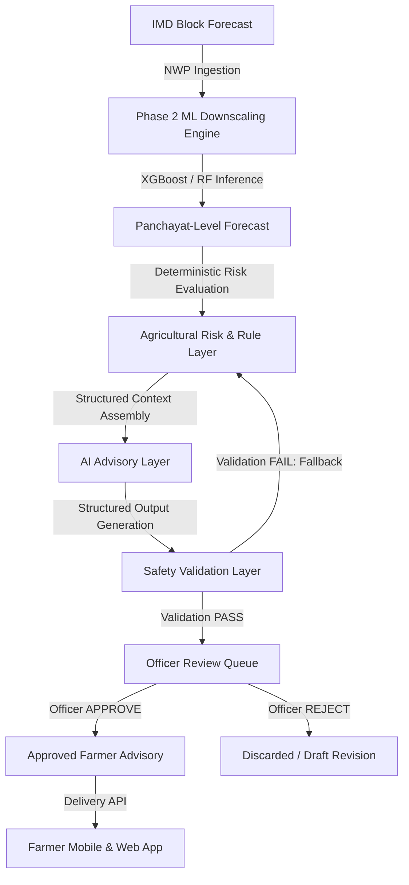
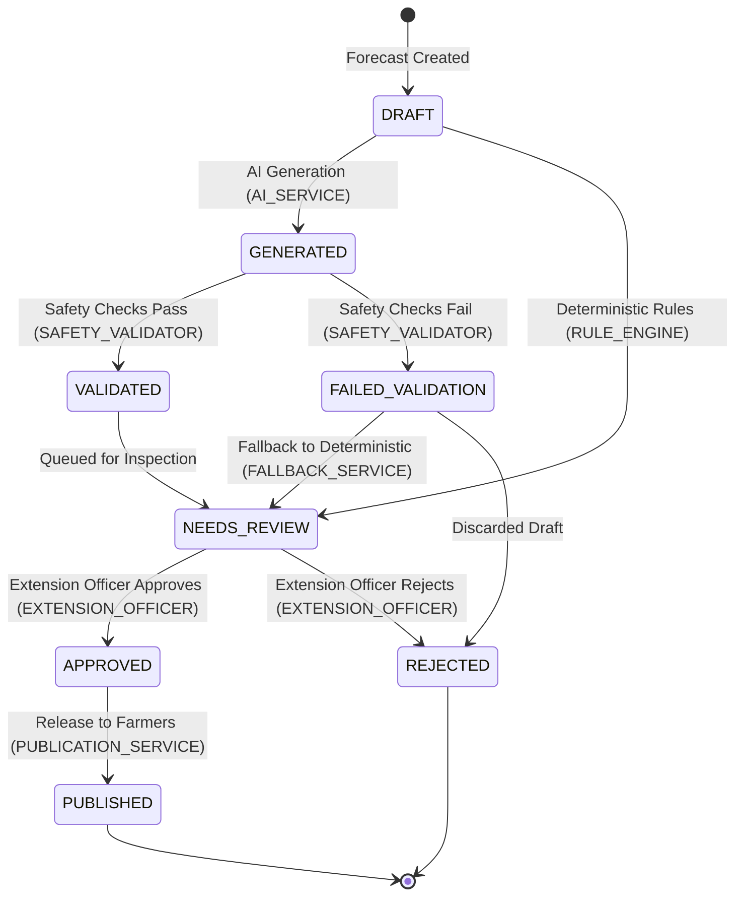

# Phase 5 Weather Intelligence + Agricultural Advisory System Architecture & Data Contracts

**Status:** Architecture & Contracts Defined  
**Scope:** GramSevak Backend (`backend.app.schemas.advisory_contracts`, `src.advisory.lifecycle`, `src.advisory.safety_rules`, `src.advisory.context_builder`)  
**Pipeline:** IMD Block Forecast → Panchayat-Level Downscaling → Panchayat Forecast → Deterministic Risk/Rule Layer → AI Advisory → Safety Validation → Officer Review → Approved Farmer Advisory

---

## 1. Target Pipeline Overview



---

## 2. Layer Responsibilities & Invariants

| Layer | Primary Responsibility | Enforced System Invariants |
| :--- | :--- | :--- |
| **A. Weather Forecast Layer** | Numerical weather prediction downscaled to Panchayat level. | **ML owns numerical weather prediction.** AI must never modify, adjust, or invent numerical weather predictions. |
| **B. Panchayat Context Layer** | Administrative spatial metadata (`panchayats`, `blocks`, `districts` via `HierarchyRepository`). | Spatial hierarchy is the single source of truth for IDs, LGD codes, coordinates, and elevation. |
| **C. Agricultural Risk/Rule Layer** | Evaluates weather variables against deterministic agronomic thresholds. | **Rules own deterministic agricultural risk logic.** Provides baseline recommendations and operational guidance. |
| **D. AI Advisory Layer** | Articulates validated structured context into farmer-friendly natural language. | Receives strictly typed structured inputs; returns strictly typed structured fields (no free-form blobs). |
| **E. Safety Validation Layer** | Automated guardrails inspecting generated content before human inspection. | Must verify numerical consistency, chemical dosage safety, and hallucination absence. |
| **F. Officer Review Layer** | Agricultural extension officers inspect, edit/amend remarks, and approve or reject. | **Officer approval is mandatory.** No advisory can ever reach farmers without explicit approval. |
| **G. Farmer Delivery Layer** | Serves approved, localized advisories to farmers via mobile and web. | Sanitized of internal debug metrics, model weights, and raw identifiers. |
| **H. Audit/Traceability Layer** | Maintains immutable end-to-end lineage for every advisory. | Every advisory traces to forecast ID, Panchayat ID, ML model, rule version, validator report, and officer ID. |

---

## 3. Advisory Data Contracts

Defined in `backend.app.schemas.advisory_contracts`:

### 3.1 Panchayat Context (`PanchayatContext`)
- `panchayat_id` (int): Database identifier.
- `panchayat_name` (str): Village name.
- `panchayat_code` (str, optional): Administrative code.
- `lgd_code` (int): Local Government Directory code.
- `block_id` (int, optional) & `block_name` (str): Tehsil/Block context.
- `district_id` (int, optional) & `district_name` (str): District context.
- `latitude` (float, optional) & `longitude` (float, optional): Center coordinates.
- `elevation_m` (float, optional): Elevation in meters.

### 3.2 Forecast Context (`ForecastContext`)
- `forecast_id` (int): Target forecast record ID in `downscaled_forecasts`.
- `forecast_date` (date) & `forecast_issue_date` (date): Date sequence (must satisfy `forecast_date >= forecast_issue_date`).
- `lead_days` (int): Days between issue date and target date.
- `block_forecast_rainfall_mm` (float): Baseline regional NWP rainfall.
- `downscaled_rainfall_mm` (float): Downscaled rainfall for the Panchayat.
- `rainfall_category` (str): IMD intensity classification.
- `model_name` (str) & `model_version` (str): ML model provenance.
- `confidence` (float, optional): Statistical certainty (null if uncalibrated).
- **Currently Unavailable Variables (Optional/Future):**
  - `temperature_c` (None)
  - `humidity_pct` (None)
  - `wind_speed_kmh` (None)
  - `soil_moisture_index` (None)  
  *Note: These fields default to `None` and are not fabricated.*

### 3.3 Agricultural Risk & Baseline Rules
- `AgriculturalRiskItem`: `risk_type`, `severity` (LOW, MODERATE, HIGH, CRITICAL), `triggering_condition`, `supporting_values`, `rule_id`, `rule_version`.
- `DeterministicRecommendationContext`: `recommended_actions` (list of strings), `timing_window`, `operational_guidance` (e.g. `{"spraying": "POSTPONE", "tillage": "PERMITTED", "drainage": "NORMAL"}`).

---

## 4. AI Advisory Input / Output Contracts

### 4.1 Input Contract (`AIAdvisoryInputContract`)
Passed to the future AI generator:
- `panchayat_context`: Validated `PanchayatContext`.
- `forecast_context`: Validated `ForecastContext`.
- `risks`: Evaluated `List[AgriculturalRiskItem]`.
- `deterministic_recommendations`: Baseline `DeterministicRecommendationContext`.
- `target_language`: Canonical language code (`en`, `mr`, `hi`).
- `advisory_constraints`: Safety boundaries (no dosage prescribing, no weather altering).

### 4.2 Output Contract (`AIAdvisoryOutputContract`)
Structured payload required from the future AI generator:
- `summary` (str, 10-500 chars): High-level headline.
- `what_is_happening` (str, 10-1000 chars): Tier 1 meteorological description.
- `why_it_matters` (str, 10-1000 chars): Tier 2 agronomic impact on crops/soil.
- `recommended_actions` (List[str], >= 1 item): Tier 3 actionable operational steps.
- `timing` (str): Timeframe and validity period.
- `severity` (`AdvisorySeverityEnum`): Risk urgency.
- `warnings` (List[str]): Threshold caution alerts.
- `supporting_forecast_reference` (Dict[str, Any]): Grounding reference validating input forecast link.

---

## 5. Advisory Status Lifecycle

State machine implemented in `src.advisory.lifecycle`:



### Transition Invariants
- `GENERATED -> PUBLISHED` is **FORBIDDEN** (prevents unreviewed AI release).
- `DRAFT -> PUBLISHED` is **FORBIDDEN**.
- `REJECTED -> APPROVED` is **FORBIDDEN** (requires generating a new draft).
- `APPROVED -> DRAFT` is **FORBIDDEN** (approved advisories are immutable).

---

## 6. Safety Boundaries & Guardrails

Implemented in `src.advisory.safety_rules`:

1. **Weather Numerical Consistency:** Rainfall figures cited in text must match input downscaled rainfall within 0.5 mm tolerance. AI is prohibited from inventing rainfall numbers.
2. **Chemical Dosage Safety:** Regular expressions block specific chemical dosage formulas (`X ml per acre`, `mix X gm`). AI cannot prescribe chemical recipes or brand dosages.
3. **Medical & Emergency Safeguard:** Prohibits unauthorized human medical claims or unsupported disaster panics (`tsunami`, `emergency evacuation immediately`).
4. **Content Completeness:** Enforces presence of all 3 tiers (`what_is_happening`, `why_it_matters`, `recommended_actions`).
5. **Fallback Principle:** If AI generation fails, times out, or fails automated safety validation, the system falls back to the deterministic agronomic rule output. The advisory source is recorded as `DETERMINISTIC_FALLBACK` and advanced to `NEEDS_REVIEW`.

---

## 7. Traceability Requirements

Implemented in `AdvisoryTraceabilityContract`:
- **Spatial Link:** `panchayat_id`.
- **Forecast Link:** `forecast_id`, `forecast_date`, `forecast_issue_date`, `source_forecast_reference`.
- **Downscaling Provenance:** `downscaled_rainfall_mm`, `ml_model_name`, `ml_model_version`.
- **Agronomic Provenance:** `rule_version`, `advisory_source` (DETERMINISTIC_RULE, AI_AUGMENTED, DETERMINISTIC_FALLBACK).
- **AI Provenance:** `ai_provider`, `ai_model`, `ai_prompt_version`.
- **Safety Audit:** Full `SafetyValidationReport` snapshot with checked rules and violation logs.
- **Human Oversight:** `officer_id`, `officer_action`, `officer_comment`, `action_timestamp`.
- **Publication Audit:** `publication_timestamp`, `approved_content_hash`.

---

## 8. Deterministic Agricultural Risk & Recommendation Rule Engine (Phase 5.2)

Implemented in `src.advisory.rule_engine` (`DeterministicRuleEngine`):

### 8.1 Rule Categories Implemented
1. `EXTREME_WEATHER`: Critical hazard management for extreme inundation.
2. `DRAINAGE`: Soil saturation and furrow discharge protocols.
3. `FIELD_OPERATIONS`: Tillage window and soil compaction prevention.
4. `FERTILIZER`: Runoff and nitrogen leaching safeguards.
5. `HARVEST`: Post-harvest produce shelter advisories.
6. `SPRAYING`: Foliar chemical wash-off precautions.
7. `IRRIGATION`: Natural precipitation recharge suspension and dry weather irrigation scheduling.
8. `TEMPERATURE_STRESS`: Thermal crop stress (conditional on temperature availability).

### 8.2 Rule Catalog & Threshold Provenance

| Rule ID | Category | Parameter | Condition | Provenance & Source | Status | Priority |
| :--- | :--- | :--- | :--- | :--- | :--- | :--- |
| `AGRO_RULE_EXTREME_INUNDATION_V1` | `EXTREME_WEATHER` | `downscaled_rainfall_mm` | `> 115.5 mm` | IMD Very Heavy Rainfall standard (>115.5 mm) | Authoritative | 1 |
| `AGRO_RULE_HEAVY_RAIN_DRAINAGE_V1` | `DRAINAGE` | `downscaled_rainfall_mm` | `> 64.4 mm` | IMD Heavy Rainfall (>64.4 mm) / ICAR Drainage Guidelines | Authoritative | 2 |
| `AGRO_RULE_TILLAGE_RESTRICTION_V1` | `FIELD_OPERATIONS` | `downscaled_rainfall_mm` | `> 15.5 mm` | ICAR Soil Management / Tilth Preservation (>15.5 mm) | Authoritative | 4 |
| `AGRO_RULE_FERTILIZER_LEACHING_V1` | `FERTILIZER` | `downscaled_rainfall_mm` | `> 15.5 mm` | ICAR Nutrient Best Management Practices (>15.5 mm) | Authoritative | 4 |
| `AGRO_RULE_HARVEST_SHELTER_V1` | `HARVEST` | `downscaled_rainfall_mm` | `> 15.5 mm` | ICAR Post-Harvest Protection Guidelines (>15.5 mm) | Authoritative | 3 |
| `AGRO_RULE_SPRAY_WASHOFF_V1` | `SPRAYING` | `downscaled_rainfall_mm` | `> 2.5 mm` | ICAR Plant Protection (wash-off threshold >2.5 mm) | Authoritative | 5 |
| `AGRO_RULE_IRRIGATION_SUSPENSION_V1`| `IRRIGATION` | `downscaled_rainfall_mm` | `> 2.5 mm` | ICAR Water Management / Daily Evapotranspiration | Authoritative | 6 |
| `AGRO_RULE_VERY_LIGHT_RAIN_ROUTINE_V1`| `FIELD_OPERATIONS`| `downscaled_rainfall_mm` | `0.0 < rf <= 2.5`| IMD Very Light Rainfall Classification (0.1–2.5 mm) | Authoritative | 8 |
| `AGRO_RULE_DRY_WEATHER_IRRIGATION_V1` | `IRRIGATION` | `downscaled_rainfall_mm` | `== 0.0 mm` | IMD No Significant Rainfall Classification (0.0 mm) | Authoritative | 9 |
| `AGRO_RULE_HEAT_STRESS_PROTOTYPE_V1` | `TEMPERATURE_STRESS`| `temperature_c` | `> 38.0 °C` | ICAR Thermal Stress Guidelines (>38°C flower abortion)| Prototype (Needs validation) | 3 |

### 8.3 Input Variables & Availability
- **Primary / Active:** `downscaled_rainfall_mm` (downscaled by Phase 2 ML), `block_forecast_rainfall_mm`, `lead_days`.
- **Optional / Future:** `temperature_c`, `humidity_pct`, `wind_speed_kmh`, `soil_moisture_index`. Default to `None` in current pipeline.

### 8.4 Missing Data & Edge Case Safety
- **Missing Rainfall:** Never assumed to be `0.0 mm`. Rainfall-dependent rules do not trigger. Evaluation trace records `skipped=True`. Operational guidance defaults to `"UNKNOWN"`.
- **Missing Temperature:** Temperature rules safely skip with documented reason.
- **Invalid Numerics:** Rejects `NaN`, `Inf`, and negative rainfall values without throwing uncaught exceptions.
- **Missing Forecast Date:** Timing-dependent recommendations are marked unavailable (`timing_window = "Timing unavailable (missing forecast date)"`).
- **Missing Panchayat Context:** Structured validation error returned in `validation_errors` (or raises `RuleEngineValidationError` if strict mode enabled).

### 8.5 Output Structure & Deterministic Ordering
`RuleEngineEvaluationResult`:
- `risks`: List of `AgriculturalRiskItem` sorted deterministically by severity (`CRITICAL > HIGH > MODERATE > LOW`) then `rule_id`.
- `recommendation_context`: `DeterministicRecommendationContext` containing:
  - `recommended_actions`: Consolidated, deduplicated action strings ordered by rule priority.
  - `timing_window`: Timing window from highest-priority triggered rule.
  - `operational_guidance`: Dict mapping operation keys (`spraying`, `tillage`, `drainage`, `irrigation`) to guidance tokens, resolved deterministically by priority.
- `triggered_rules`: Triggered rules sorted by priority (`1 = critical`) then `rule_id`.
- `evaluation_trace`: Complete audit trail of all evaluated rules (triggered, skipped, actual values, thresholds).
- `validation_errors`: Structured non-blocking warnings or validation issues.
- `rule_version`: Immutable version string (`v1.0.0`).

### 8.6 Known Limitations
- Current ML forecasts downscaled rainfall only; thermal and moisture index rules remain conditional prototypes until multi-variable sensors/models are added.
- General agronomic rules apply at the Panchayat level; crop-specific phenological thresholds require farm-level crop profile inputs.

---

## 9. Canonical Advisory Context & Risk Generation (Phase 5.3)

Implemented in `src.advisory.context_builder` (`AdvisoryContextService`) and `backend.app.schemas.advisory_contracts` (`AdvisoryContext`):

### 9.1 AdvisoryContext Canonical Contract
The internal pipeline envelope uniting authoritative spatial metadata, numerical forecasts, and deterministic risk outputs:
```text
AdvisoryContext
├── panchayat: PanchayatContext
├── forecast: ForecastContext
├── risks: List[AgriculturalRiskItem]
├── recommendations: DeterministicRecommendationContext
├── traceability: AdvisoryTraceabilityContract
└── validation_errors: List[str]
```

### 9.2 Data Sources & Performance Optimization
- **Spatial Metadata:** Queried via `HierarchyRepository.get_panchayat_by_id(eager_load_parents=True)` in a single indexed join across `panchayats`, `blocks`, and `districts`. Avoids multi-query round-trips.
- **Forecast Ingestion:** Queried directly from `downscaled_forecasts` table preserving original Phase 2 model names, versions, issue dates, and downscaled rainfall.

### 9.3 Validation Rules & Freshness Policy
- **Panchayat Existence & Parentage:** Confirms valid database identifier; optional `expected_block_id` and `expected_district_id` prevent cross-jurisdiction routing errors.
- **Forecast Ownership:** Enforces `forecast.panchayat_id == panchayat_id`. Mismatches raise `ForecastPanchayatMismatchError`.
- **Temporal Integrity:** Enforces `forecast_issue_date <= forecast_date`. Issue dates later than forecast dates raise `InvalidForecastDataError`.
- **Physical Numerical Range:** Validates that `downscaled_rainfall_mm` and `block_forecast_rainfall_mm` are finite, non-negative numbers. Rejects `NaN`, `Inf`, and negative values.
- **Deterministic Multi-Record Resolution:** When multiple forecast records exist for the same Panchayat and target date, the engine resolves deterministically via:
  `ORDER BY forecast_issue_date DESC, created_at DESC, id DESC`.

### 9.4 Error Handling Taxonomy
Structured exceptions subclassing `AdvisoryContextError`:
- `PanchayatNotFoundError`: HTTP 404
- `ForecastNotFoundError`: HTTP 404
- `HierarchyMismatchError`: HTTP 422
- `ForecastPanchayatMismatchError`: HTTP 422
- `InvalidForecastDataError`: HTTP 422
- `RuleEvaluationError`: HTTP 422

### 9.5 Internal API Integration
Exposed as `GET /api/v1/advisory/context/{panchayat_id}`:
- Query parameters: `forecast_id` (optional), `forecast_date` (optional).
- Returns the complete strongly-typed `AdvisoryContext`.
- Operates strictly as a read-only context preparation layer (does not call LLMs, publish advisories, or alter forecasts).

---

## 10. AI Advisory Service & Provider Abstraction (Phase 5.4)

Implemented in `src.advisory.ai_service` (`AIAdvisoryService`, `AIAdvisoryProvider`, `MockAIAdvisoryProvider`, `HttpAIAdvisoryProvider`, `AdvisoryPromptBuilder`) and configured via `backend.app.core.config`:

### 10.1 AI Service Boundary
The AI layer converts validated structured `AdvisoryContext` into farmer-understandable advisory text. It acts as an explanation and synthesis layer, strictly bounded by the following invariants:
- **No Numerical Weather Prediction:** It cannot calculate, alter, round, or reinterpret numerical weather predictions.
- **No Risk Invention:** It cannot invent agricultural risks or recommendations outside the supplied deterministic rule evaluation.
- **No Direct Publishing:** AI advisory generation is an intermediate internal step; advisories are not delivered directly to farmers and require downstream safety validation (Phase 5.5) and officer approval (Phase 5.6).
- **Forecast Groundedness Verification:** The service actively verifies that the generated advisory's `supporting_forecast_reference` matches the input downscaled rainfall within 0.05 mm tolerance. Mismatches raise `ForecastGroundednessViolationError`.

### 10.2 Provider-Neutral Abstraction
The system decouples core business logic from vendor SDKs via `AIAdvisoryProvider`:
```text
AdvisoryContext
      ↓
AdvisoryPromptBuilder (Versioned v1.0.0)
      ↓
AIAdvisoryProvider (generate_advisory_text)
 ├── MockAIAdvisoryProvider (Deterministic, Zero-API-key dev & test)
 └── HttpAIAdvisoryProvider (JSON-schema HTTP REST for Gemini/OpenAI/Ollama)
      ↓
Strict JSON Parser & Schema Validator
      ↓
Forecast Groundedness Check
      ↓
AIAdvisoryOutputContract + AIExecutionMetadata
```

### 10.3 Configuration Requirements
Defined in `backend.app.core.config.Settings`:
- `AI_ADVISORY_PROVIDER`: Provider name (`"mock"` default, or `"http"`).
- `AI_ADVISORY_MODEL`: Model identifier (default `"mock-agricultural-advisor-v1"`).
- `AI_ADVISORY_API_KEY`: Secret API key (optional/None by default; never committed or logged).
- `AI_ADVISORY_ENDPOINT`: Custom HTTP endpoint URL (optional).
- `AI_ADVISORY_TIMEOUT_SECONDS`: Request timeout (default `15.0` s).
- `AI_ADVISORY_MAX_RETRIES`: Bounded retry count (default `2`).
- `AI_ADVISORY_TEMPERATURE`: Generation temperature (default `0.2`).

### 10.4 Input & Output Contracts
- **Input Contract:** Exclusively consumes `AdvisoryContext` containing `PanchayatContext`, `ForecastContext`, `AgriculturalRiskItem` list, and `DeterministicRecommendationContext`. No raw database entities, secrets, or unbounded app state are passed.
- **Output Contract:** Strictly parses and validates provider output into `backend.app.schemas.advisory_contracts.AIAdvisoryOutputContract`:
  - `summary`: One-sentence overview.
  - `what_is_happening`: Weather explanation tied to exact forecast.
  - `why_it_matters`: Agronomic implications grounded in deterministic risks.
  - `recommended_actions`: Action items derived from deterministic recommendations.
  - `timing`: Timing window derived from rule outputs.
  - `severity`: Overall advisory severity matching contract enum.
  - `warnings`: Actionable warnings.
  - `supporting_forecast_reference`: Exact rainfall reference.
  - `audit_metadata`: Execution metadata (`provider`, `model`, `prompt_version`, `latency_ms`, `context_fingerprint`, `is_mock`).

### 10.5 Prompt Versioning
Constructed by `AdvisoryPromptBuilder` with explicit prompt version `v1.0.0`. Enforces 3 tiers of communication (What is happening, Why it matters, Recommended actions), safety constraints (no ungrounded disease diagnosis, no ungrounded chemical dosage, no emergency alarms), and strict JSON schema output matching `AIAdvisoryOutputContract`.

### 10.6 Failure Behavior & Bounded Retries
The service handles failure gracefully through a structured exception taxonomy:
- `AIProviderTimeoutError`: HTTP/socket timeout after `AI_ADVISORY_TIMEOUT_SECONDS`. Retried up to `max_retries`.
- `AIProviderUnavailableError`: Network or 5xx server error. Retried up to `max_retries`.
- `AIProviderRateLimitError`: HTTP 429 response. Retried up to `max_retries`.
- `AIProviderAuthError`: HTTP 401/403 or missing API keys. Permanent; never retried.
- `AIOutputValidationError`: Malformed JSON or schema violation. Never retried.
- `ForecastGroundednessViolationError`: AI hallucinated or mutated forecast rainfall. Never retried.

### 10.7 Deterministic Development Mode
`MockAIAdvisoryProvider` provides deterministic, reliable mock generation for local development and CI testing without external internet access or API credentials. It synthesizes compliant output from the input `AdvisoryContext`, strictly preserves exact rainfall numbers, and tags all output with `is_mock=True`.

### 10.8 Real-Provider Verification Status
In the current development environment, no live external LLM API credentials (`GEMINI_API_KEY`, `OPENAI_API_KEY`, or `AI_ADVISORY_API_KEY`) were configured. In accordance with Section 16 instructions, tests and verification were performed via the deterministic mock provider; live provider verification was not performed and no mock outputs are presented as real AI inferences.

---

## 11. Safety Validation & Deterministic Fallback Layer (Phase 5.5)

Implemented in `src.advisory.safety_validator` (`AdvisoryValidationService`, `AdvisorySchemaValidator`, `ForecastGroundingValidator`, `RuleGroundingValidator`, `AdvisorySafetyValidator`, `DeterministicFallbackBuilder`) and canonical schemas in `backend.app.schemas.advisory_contracts`:

### 11.1 Validation Architecture & Layers
The safety validation engine operates post-generation, independently of the AI provider:
```text
AI Advisory Output (or Service Error)
           ↓
[Layer 1: AdvisorySchemaValidator]
- Field completeness, string lengths, valid severity enum, forecast ref dict
           ↓
[Layer 2: ForecastGroundingValidator]
- Rainfall tolerance (±0.05 mm in ref, ±0.5 mm in text)
- Temperature consistency (disallows hallucination if unmeasured)
- Date and location consistency (prohibits alien dates or districts)
           ↓
[Layer 3: RuleGroundingValidator]
- Severity coherence (CRITICAL risk cannot be downgraded to LOW)
- Operational guidance consistency (no immediate spraying if DELAY/PAUSE)
- Prohibits hallucinating severe weather in dry 0.0 mm conditions
           ↓
[Layer 4: AdvisorySafetyValidator]
- Banned chemical dosage & numeric mixing patterns
- Medical claims, panic-inducing terms, and fake emergency alarms
- Unsupported certainty claims (100% crop loss, zero risk)
- Unsupported crop disease diagnoses without pathology input
- Dangerous physical instructions (wading into deep floodwaters)
           ↓
Safety Pass?
├── YES → AdvisoryValidationResult(status=VALID, advisory=AI output)
└── NO  → AdvisoryValidationResult(status=FALLBACK, advisory=Deterministic fallback)
           ↓
Queue for Future Phase 5.6 Extension Officer Review (NEEDS_REVIEW)
```

### 11.2 Validation States & Severity Tiers
- **Validation Statuses (`ValidationStatusEnum`):**
  - `VALID`: Advisory passed all structural, grounding, and content safety checks.
  - `FALLBACK`: AI output failed validation or provider failed; deterministic fallback generated.
  - `INVALID`: Content structurally malformed or irreparably unsafe.
  - `REVIEW_REQUIRED`: Advisory flagged for mandatory officer attention before action.
- **Validation Severity Tiers (`ValidationSeverityEnum`):**
  - `PASS`: All safety rules satisfied without findings.
  - `WARNING`: Non-blocking observations preserved for officer review.
  - `ERROR`: Recoverable issue triggering fallback.
  - `CRITICAL`: Safety breach, weather contradiction, or provider failure triggering deterministic fallback.

### 11.3 Deterministic Fallback System
When the AI service times out, returns HTTP errors, generates malformed JSON, alters numerical weather predictions, or violates safety boundaries, `DeterministicFallbackBuilder` automatically synthesizes an authoritative advisory from `AdvisoryContext`:
- Summarizes conditions using triggered Phase 5.2 rule titles and IMD rainfall categories.
- Factual meteorological explanation grounded in authoritative downscaled rainfall.
- Explains agronomic risks directly from deterministic rule descriptions.
- Employs exact deterministic `recommended_actions` and `timing_window`.
- Identifies source as `AdvisorySourceEnum.DETERMINISTIC_FALLBACK` with explicit `fallback_reason`.

### 11.4 Traceability & Non-Publication Invariant
- **Traceability (`AdvisoryTraceabilityContract`):** Preserves `panchayat_id`, `forecast_id`, `forecast_date`, `forecast_issue_date`, `ml_model_name`, `rule_version`, `validator_version` (`v1.0.0`), `advisory_source`, and `validation_report`.
- **Officer Quarantine:** AI-generated or fallback advisories are NEVER published directly to farmers. They are placed in quarantine (`NEEDS_REVIEW`) awaiting Phase 5.6 human extension officer approval.

### 11.5 Known Limitations
- Multi-variable thresholds (e.g. soil moisture index, relative humidity) remain conditional until real sensor integration in future phases.
- Disease diagnostic checks rely on bounded pattern and terminology recognition; domain-specific crop pathology models will be evaluated in future agronomic expansions.

---

## 12. Officer Review, Approval, Editing, and Audit Workflow (Phase 5.6)

Implemented in `backend.app.api.v1.endpoints.officer`, `src.advisory.audit_service`, `backend.app.models.advisory`, and `officer_dashboard`:

### 12.1 Lifecycle State Machine & Review Workflow
All advisories resulting from Phase 5.5 safety validation (whether valid AI or deterministic fallback) enter the system under review quarantine:
```text
Phase 5.5 Validated Advisory / Deterministic Fallback
                        ↓
            [State: NEEDS_REVIEW] (version 1)
                        │
       ┌────────────────┼────────────────┐
       ↓                ↓                ↓
[Officer Edit]    [Officer Approve] [Officer Reject]
       ↓                ↓                ↓
[State: EDITED]  [State: APPROVED] [State: REJECTED]
       │                │                │
       │ (can re-edit   │                │ (terminal state,
       │  or approve)   │ (quarantine    │  requires explicit
       └───────┬────────┘  lifted;       │  rejection reason)
               ↓           eligible for  └───────────────
          [APPROVED]       farmer pub)
```

- Allowed State Transitions:
  - `GENERATED` → `NEEDS_REVIEW`
  - `NEEDS_REVIEW` → `APPROVED`
  - `NEEDS_REVIEW` → `EDITED`
  - `NEEDS_REVIEW` → `REJECTED`
  - `EDITED` → `APPROVED`
  - `EDITED` → `EDITED`
  - `EDITED` → `REJECTED`
  - `DRAFT` (legacy) → `APPROVED` / `REJECTED`
  - Terminal: `REJECTED` and `SUPERSEDED` cannot be approved or edited.

### 12.2 Three-Tier Content Snapshots
To ensure complete forensic auditability and eliminate silent data mutations, every advisory maintains three immutable content snapshots:
1. `original_content`: The verbatim output generated by AI or deterministic fallback. Preserved permanently and cannot be modified.
2. `edited_content`: The human extension officer's modifications, populated whenever an officer edits text or actions.
3. `approved_content`: The exact snapshot of content at the moment of approval (taking `edited_content` if present, otherwise `original_content`). This is the only text eligible for downstream publication.

### 12.3 Edit Safety & Forecast Invariant Protection
Officer editing is restricted to agronomic wording, action refinements, and local contextual guidance:
- **Numerical Weather Immutability:** Officers cannot modify numerical rainfall or weather metrics. The downscaled forecast remains immutable. Edits are re-validated through `ForecastGroundingValidator` to guarantee consistency with authoritative weather data.
- **Safety Re-Validation:** All officer edits pass through `AdvisorySafetyValidator` to prevent introducing ungrounded chemical mixing dosages, alarming emergency panic statements, or unsupported crop disease diagnoses.
- Failed edits are rejected immediately with HTTP 422 Unprocessable Entity and detailed safety violation findings.

### 12.4 Optimistic Concurrency Control (OCC)
To prevent race conditions and concurrent overwrite hazards in multi-officer districts:
- Every advisory record maintains a monotonic integer `version` field.
- Mutation endpoints (`PUT /officer/advisories/{id}`, `POST /officer/advisories/{id}/approve`, `POST /officer/advisories/{id}/reject`) require the client to supply `current_version`.
- If the supplied `current_version` does not match the database `version`, the request is rejected with HTTP 409 Conflict.

### 12.5 Role-Based Access Control (RBAC) & Spatial Jurisdiction
- **Role Enforcement:** Farmers (`X-Officer-Role: FARMER`) and unauthenticated actors are forbidden from accessing officer endpoints (HTTP 403 Forbidden). Only authorized extension officers (`AGRICULTURAL_OFFICER`, `DISTRICT_SUPERVISOR`, `SYSTEM_ADMIN`) may review, edit, approve, or reject.
- **Spatial Jurisdiction:** An officer's spatial authorization scope (`X-Officer-District`) is verified against the advisory's panchayat district. An officer cannot approve or edit advisories for panchayats outside their assigned jurisdiction.

### 12.6 Immutable Audit Trail
Every lifecycle state change and edit writes an immutable record to the `advisory_audit_logs` table:
- Attributes: `advisory_id`, `officer_id`, `officer_name`, `officer_role`, `action` (`GENERATED`, `EDITED`, `APPROVED`, `REJECTED`), `previous_status`, `new_status`, `version`, `reason`, `diff_summary`, `created_at`.
- Endpoints: `GET /officer/advisories/{id}/audit-trail` exposes full historical traceability.

### 12.7 Farmer Publication Isolation Invariant
Unapproved advisories (`NEEDS_REVIEW`, `EDITED`, `REJECTED`, `GENERATED`) are strictly isolated from farmers. The farmer-facing forecast endpoints only query advisories with `status = APPROVED`, guaranteeing no raw AI hallucinations or unreviewed drafts ever reach end-users.

---

## 13. Farmer Application Integration & Controlled Multilingual Delivery (Phase 5.7)

### 13.1 Publication Boundary & Authority
- **Backend Authority:** The farmer client (`farmer_app`) never decides whether an advisory is approved. The backend (`GET /api/v1/farmer/panchayat/{id}`) filters strictly by `status == 'APPROVED'`.
- **Isolation of Unapproved Content:** When no approved advisory exists for the Panchayat and date, the API returns `advisory_status: "NO_APPROVED_ADVISORY"` with empty advisory strings. Drafts, generated proposals, validation diagnostics, rejected records, and officer comments are never exposed to farmers.
- **Client Sanitization:** All internal pipeline metadata (officer IDs, LLM prompts, validation logs, raw tokens, database keys) are stripped before JSON serialization.

### 13.2 Farmer-Facing 3-Tier Advisory Contract
The farmer experience decomposes advisory guidance into four cognitive tiers:
1. **What is happening?** (`what_is_happening`): Authoritative weather statement with exact numerical rainfall and classification downscaled to the Panchayat.
2. **Why it matters?** (`why_it_matters`): Agronomic significance explaining the impact on local soils, crops (e.g. onions, grapes), and farm operations.
3. **What should I do?** (`recommended_actions`): Concrete, numbered actionable steps (e.g., suspend spraying, open drainage trenches).
4. **When should I do it & Operational Warnings** (`timing`, `warnings`): Specific operational windows and safety constraints (e.g., avoid pre-rain fertilizer broadcast).

### 13.3 Controlled Multilingual Delivery & Numerical Immutability
- **Supported Languages:** English (`en`), Marathi (`mr`), Hindi (`hi`).
- **Translation Strategy:** Controlled deterministic agronomic templates (`src.advisory.localization`) grounded in verified Maharashtra agricultural extension terminology.
- **Strict Numerical Immutability:** Weather numerical values (`rainfall_mm`, forecast dates, units `mm` / `मिमी`) are strictly preserved without alteration or hallucination across all target languages. AI is never permitted to calculate or approximate numerical values during translation.
- **Language Negotiation:** Farmers select their preferred language via top-level app preferences or the in-screen language switch pill (`en`, `mr`, `hi`). The backend dynamically serves validated localized content based on the `?lang=` query parameter.

### 13.4 Offline Resilience & Caching Policy
- **Request Deduplication & Caching:** `FarmerRepository` caches the last successfully retrieved approved forecast per Panchayat and language.
- **Safe Offline Presentation:** On transient network failure or timeout, `FarmerRepository` provides cached approved advisory content with a clear visual notice (`cached_notice: "Offline / cached advisory"`), ensuring farmers in low-connectivity rural zones retain access to vital guidance without misleading them regarding real-time freshness.
- **Farmer-Safe Errors:** Technical exceptions, stack traces, and database connection strings are intercepted and replaced with farmer-friendly guidance ("Unable to load latest advisory. Please try again.").
