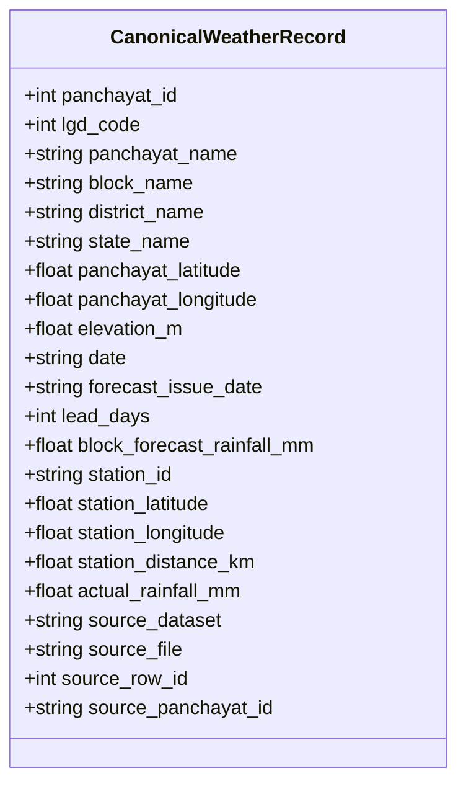
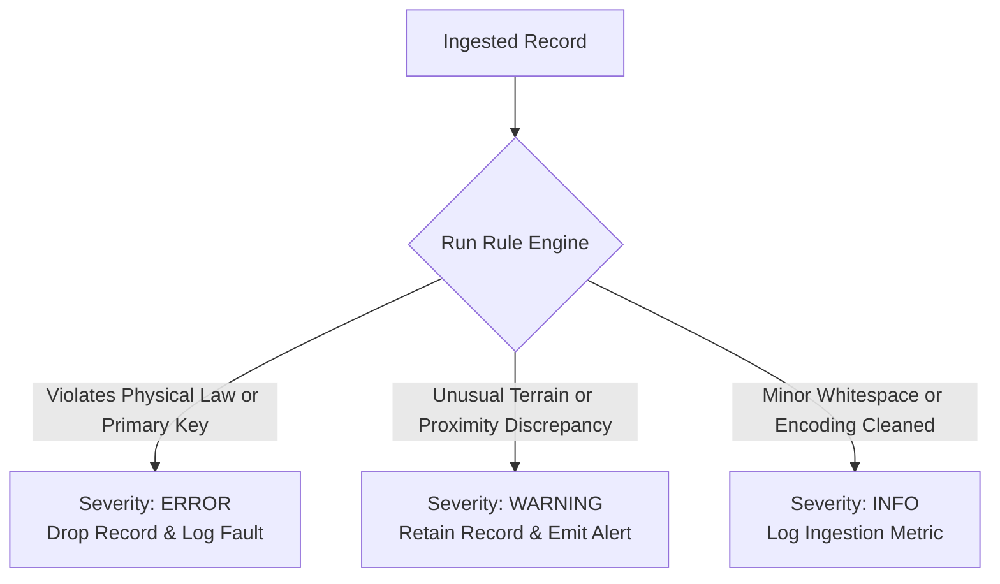

# GramSevak Canonical Weather Data Schema & Multi-District Reconciliation

**Document Version:** 1.0.0  
**Phase:** 1.3 Specification  
**Status:** Approved Architectural Contract  
**Date:** 2026-09-26  
**Auditor / Architect:** Antigravity AI Agent  
**Branch:** `phase-1-data-foundation`  

---

## 1. Purpose

The objective of the GramSevak canonical weather data schema is to establish a unified, robust, district-agnostic data contract capable of ingesting, validating, downscaling, and serving micro-level meteorological data across Maharashtra and India.

Prior to Phase 1.3, the repository contained siloed scripts with hardcoded pilot assumptions:
- Nashik used 1-based local integer IDs (`1001`), snapshot timestamps (`lead_days = 0`), title-cased names, and `latin1` raw encoding with trailing delimiters (`Unnamed: 16`).
- Pune used composite string IDs (`MH_27_PUNE_185262`), continuous daily time-series (`lead_days = 1`), uppercase text (`PUNE`, `AMBEGAON`), and standard `UTF-8` encoding.
- Downstream systems (FastAPI, ML downscaling, advisory rule engines, React dashboard, Flutter mobile client) required a stable, single source of truth without separate pipelines for each jurisdiction.

This canonical schema reconciles these differences into a single normalized data contract that preserves 100% of source information without silent data loss.

---

## 2. Canonical Schema Architecture

The canonical architecture consists of 22 strongly-typed fields: 18 core domain fields and 4 source traceability fields.



---

## 3. Field Definitions

| # | Field Name | Category | Definition | Example Value |
|---|---|---|---|---|
| 1 | `panchayat_id` | Administrative Identity | Unique integer identifier of the Gram Panchayat. In Nashik: local sequence ID; in Pune: extracted trailing LGD integer. | `1001` (Nashik), `185262` (Pune) |
| 2 | `lgd_code` | Administrative Identity | Official 6-digit Local Government Directory (LGD) code assigned by Ministry of Panchayati Raj. | `182597`, `185262` |
| 3 | `panchayat_name` | Administrative Identity | Standardized Title Case name of the Gram Panchayat with whitespace stripped. | `"Ajmer Saundane"`, `"Ahupe"` |
| 4 | `block_name` | Administrative Identity | Standardized Title Case name of the administrative Tehsil / Block / Taluka. | `"Baglan"`, `"Ambegaon"` |
| 5 | `district_name` | Administrative Identity | Standardized Title Case administrative District name. | `"Nashik"`, `"Pune"` |
| 6 | `state_name` | Administrative Identity | Standardized administrative State name. | `"Maharashtra"` |
| 7 | `panchayat_latitude` | Spatial / Topography | Geographical latitude of the Panchayat village centroid in WGS84 decimal degrees. | `20.6385`, `19.1673` |
| 8 | `panchayat_longitude` | Spatial / Topography | Geographical longitude of the Panchayat village centroid in WGS84 decimal degrees. | `74.1201`, `73.5636` |
| 9 | `elevation_m` | Spatial / Topography | Terrain elevation of the Panchayat above mean sea level in meters. | `585.0`, `683.0` |
| 10 | `date` | Temporal | Validity target date of the 24-hour weather observation and forecast (08:30 to 08:30 IST). | `"2026-09-04"`, `"2026-05-15"` |
| 11 | `forecast_issue_date` | Temporal | Numerical weather prediction model run issue date (ISO 8601 YYYY-MM-DD). | `"2026-09-04"`, `"2026-05-14"` |
| 12 | `lead_days` | Temporal | Forecast lead horizon in days: `(date - forecast_issue_date).days`. | `0` (same day), `1` (1-day ahead) |
| 13 | `block_forecast_rainfall_mm` | Meteorological | Regional 24-hour precipitation forecast at block level issued by IMD/NCMRWF in mm. | `10.0`, `5.68` |
| 14 | `station_id` | Meteorological Station | Identifier of the reference Automatic Weather Station (AWS) or Rain Gauge (ARG). | `"Satana AWS"`, `"GHCND:IN012190101"` |
| 15 | `station_latitude` | Meteorological Station | Geographical latitude of the reference weather station in WGS84 decimal degrees. | `20.5900`, `19.0500` |
| 16 | `station_longitude` | Meteorological Station | Geographical longitude of the reference weather station in WGS84 decimal degrees. | `74.2000`, `73.8300` |
| 17 | `station_distance_km` | Meteorological Station | Great-circle Haversine distance between Panchayat centroid and station in km. | `12.55`, `13.11` |
| 18 | `actual_rainfall_mm` | Ground Truth Observation | Observed 24-hour precipitation from ground station in mm. Nullable if unobserved. | `5.6`, `0.0`, `120.3` |
| 19 | `source_dataset` | Audit Traceability | Jurisdiction identifier of the source dataset. | `"nashik"`, `"pune"` |
| 20 | `source_file` | Audit Traceability | Workspace relative path to raw source file. | `"data/raw/nashik/nashik_panchayat_weather_raw.csv"` |
| 21 | `source_row_id` | Audit Traceability | Zero-indexed line sequence number in the source raw file. | `0`, `142` |
| 22 | `source_panchayat_id` | Audit Traceability | Exact unmodified Panchayat identifier string as supplied by source agency. | `"1001"`, `"MH_27_PUNE_185262"` |

---

## 4. Data Types & Storage Representations

| Field Name | Logical Type | Python / Pandas Type | Parquet Physical Type | PostgreSQL / Supabase Type |
|---|---|---|---|---|
| `panchayat_id` | Integer | `int64` | `INT64` | `BIGINT` |
| `lgd_code` | Integer | `int64` | `INT64` | `BIGINT` |
| `panchayat_name` | Text | `string` / `object` | `BYTE_ARRAY` (UTF8) | `TEXT` |
| `block_name` | Text | `string` / `object` | `BYTE_ARRAY` (UTF8) | `TEXT` |
| `district_name` | Text | `string` / `object` | `BYTE_ARRAY` (UTF8) | `TEXT` |
| `state_name` | Text | `string` / `object` | `BYTE_ARRAY` (UTF8) | `TEXT` |
| `panchayat_latitude` | Float | `float64` | `DOUBLE` | `NUMERIC(8, 4)` |
| `panchayat_longitude` | Float | `float64` | `DOUBLE` | `NUMERIC(8, 4)` |
| `elevation_m` | Float | `float64` | `DOUBLE` | `NUMERIC(7, 2)` |
| `date` | Date | `object` (`string` YYYY-MM-DD) | `BYTE_ARRAY` (UTF8) | `DATE` |
| `forecast_issue_date` | Date | `object` (`string` YYYY-MM-DD) | `BYTE_ARRAY` (UTF8) | `DATE` |
| `lead_days` | Integer | `int64` | `INT64` | `INTEGER` |
| `block_forecast_rainfall_mm`| Float | `float64` | `DOUBLE` | `NUMERIC(7, 2)` |
| `station_id` | Text | `string` / `object` | `BYTE_ARRAY` (UTF8) | `TEXT` |
| `station_latitude` | Float | `float64` | `DOUBLE` | `NUMERIC(8, 4)` |
| `station_longitude` | Float | `float64` | `DOUBLE` | `NUMERIC(8, 4)` |
| `station_distance_km` | Float | `float64` | `DOUBLE` | `NUMERIC(7, 2)` |
| `actual_rainfall_mm` | Float | `float64` (nullable) | `DOUBLE` | `NUMERIC(7, 2)` |
| `source_dataset` | Text | `string` | `BYTE_ARRAY` (UTF8) | `TEXT` |
| `source_file` | Text | `string` | `BYTE_ARRAY` (UTF8) | `TEXT` |
| `source_row_id` | Integer | `int64` | `INT64` | `BIGINT` |
| `source_panchayat_id` | Text | `string` | `BYTE_ARRAY` (UTF8) | `TEXT` |

---

## 5. Units of Measurement

- **Geographic Coordinates:** Decimal degrees (WGS84 ellipsoid datum, EPSG:4326). North is positive; East is positive.
- **Elevation:** Meters above mean sea level ($m$).
- **Rainfall / Precipitation:** Millimeters of liquid water equivalent ($mm$). $1\text{ mm} = 1\text{ liter/m}^2$.
- **Station Distance:** Great-circle surface distance in kilometers ($km$).
- **Lead Horizon:** Calendar days ($days$).

---

## 6. Nullable & Required Fields Policy

### 6.1 Strictly Required Fields (`nullable = False`)
Every canonical record must have complete administrative, geographic, temporal, and forecast information:
- `panchayat_id`, `lgd_code`, `panchayat_name`, `block_name`, `district_name`, `state_name`
- `panchayat_latitude`, `panchayat_longitude`, `elevation_m`
- `date`, `forecast_issue_date`, `lead_days`
- `block_forecast_rainfall_mm`
- `station_id`, `station_latitude`, `station_longitude`, `station_distance_km`
- `source_dataset`, `source_file`, `source_row_id`, `source_panchayat_id`

### 6.2 Nullable Field (`nullable = True`)
- `actual_rainfall_mm`: In real-world operational deployments, weather downscaling models predict rainfall *before* ground truth observations occur. Furthermore, AWS gauges occasionally suffer hardware transmission outages. Therefore, `actual_rainfall_mm` is permitted to be null (`None` / `NaN`). When present, it must be $\ge 0.0\text{ mm}$.

---

## 7. Nashik Source Mapping Specification

**Source File:** `data/raw/nashik/nashik_panchayat_weather_raw.csv`  
**Encoding:** `latin1` (contains `\xa0` non-breaking space characters)  
**Row Count:** 1,388  

| Source Field | Canonical Field | Source Type | Canonical Type | Transformation Logic | Nullable | Validation Rule |
|---|---|---|---|---|---|---|
| `panchayat_id` | `panchayat_id` | `int64` | `int64` | Preserve direct integer (`1001` to `2388`). | No | Must be integer $\ge 1$. |
| `lgd_code` | `lgd_code` | `int64` | `int64` | Direct integer cast. | No | Range: $100000$ to $999999$. |
| `panchayat_name` | `panchayat_name` | `object` | `string` | `.str.replace('\xa0', ' ').str.strip().str.title()` | No | Non-empty string. |
| `block_name` | `block_name` | `object` | `string` | `.str.replace('\xa0', ' ').str.strip().str.title()` | No | Must belong to Nashik blocks. |
| `district_name` | `district_name` | `object` | `string` | Normalize to Title Case `"Nashik"`. | No | Must be `"Nashik"`. |
| `latitude` | `panchayat_latitude` | `float64` | `float64` | Rename column; coerce float. | No | Range: $19.0^\circ$ to $21.5^\circ\text{N}$. |
| `longitude` | `panchayat_longitude` | `float64` | `float64` | Rename column; coerce float. | No | Range: $73.0^\circ$ to $75.5^\circ\text{E}$. |
| `elevation_m` | `elevation_m` | `int64` | `float64` | Coerce float. | No | Range: $200.0$ to $1650.0\text{ m}$. |
| `date` | `date` | `object` | `string` | `pd.to_datetime(d, dayfirst=True).dt.strftime('%Y-%m-%d')` | No | ISO 8601 date. |
| `forecast_issue_date`| `forecast_issue_date`| `object` | `string` | `pd.to_datetime(d, dayfirst=True).dt.strftime('%Y-%m-%d')` | No | ISO 8601 date. |
| *Derived* | `lead_days` | N/A | `int64` | `(date - forecast_issue_date).days` (Evaluates to 0). | No | Must be $\ge 0$. |
| `block_forecast_rainfall_mm`| `block_forecast_rainfall_mm`| `float64` | `float64` | Coerce float; enforce non-negative. | No | Range: $0.0$ to $500.0\text{ mm}$. |
| `station_id` | `station_id` | `object` | `string` | `.str.strip()` | No | Non-empty text. |
| `station_latitude` | `station_latitude` | `float64` | `float64` | Coerce float. | No | Range: $19.0^\circ$ to $21.5^\circ\text{N}$. |
| `station_longitude`| `station_longitude`| `float64` | `float64` | Coerce float. | No | Range: $73.0^\circ$ to $75.5^\circ\text{E}$. |
| `station_distance_km`| `station_distance_km`| `float64` | `float64` | Verify with Haversine; preserve or round. | No | Range: $0.0$ to $120.0\text{ km}$. |
| `actual_rainfall_mm`| `actual_rainfall_mm`| `float64` | `float64` | Coerce float; replace negative/-999.9 with null. | Yes | $\ge 0.0\text{ mm}$ or null. |
| `Unnamed: 16` | *EXCLUDED* | `float64` | N/A | Drop trailing delimiter artifact (100% null). | N/A | Excluded. |
| *Metadata* | `source_dataset` | N/A | `string` | Inject constant `"nashik"`. | No | Constant `"nashik"`. |
| *Metadata* | `source_file` | N/A | `string` | Inject `"data/raw/nashik/nashik_panchayat_weather_raw.csv"`. | No | File path. |
| *Metadata* | `source_row_id` | N/A | `int64` | Inject source row index (0 to 1,387). | No | $\ge 0$. |
| *Metadata* | `source_panchayat_id` | `panchayat_id` | `string` | Cast original value to string: `str(val)`. | No | Raw source string. |

---

## 8. Pune Source Mapping Specification

**Source File:** `data/raw/pune/pune_original.csv`  
**Encoding:** `utf-8`  
**Row Count:** 187,320  

| Source Field | Canonical Field | Source Type | Canonical Type | Transformation Logic | Nullable | Validation Rule |
|---|---|---|---|---|---|---|
| `panchayat_id` | `panchayat_id` | `object` | `int64` | Extract trailing integer via regex `(\d+)$`. Matches `lgd_code` exactly. | No | Must be integer $\ge 1$. |
| `lgd_code` | `lgd_code` | `int64` | `int64` | Direct integer cast. | No | Range: $100000$ to $999999$. |
| `panchayat_name` | `panchayat_name` | `object` | `string` | `.str.strip().str.title()` (Convert uppercase to TitleCase). | No | Non-empty string. |
| `block_name` | `block_name` | `object` | `string` | `.str.strip().str.title()` (Convert uppercase to TitleCase). | No | Must belong to Pune blocks. |
| `district_name` | `district_name` | `object` | `string` | Normalize to Title Case `"Pune"`. | No | Must be `"Pune"`. |
| `panchayat_latitude`| `panchayat_latitude`| `float64` | `float64` | Direct float cast. | No | Range: $17.5^\circ$ to $19.6^\circ\text{N}$. |
| `panchayat_longitude`| `panchayat_longitude`| `float64` | `float64` | Direct float cast. | No | Range: $73.2^\circ$ to $75.3^\circ\text{E}$. |
| `elevation_m` | `elevation_m` | `int64` | `float64` | Coerce float. | No | Range: $100.0$ to $1500.0\text{ m}$. |
| `date` | `date` | `object` | `string` | `pd.to_datetime(d, format='%d-%m-%Y').dt.strftime('%Y-%m-%d')` | No | ISO 8601 date. |
| `forecast_issue_date`| `forecast_issue_date`| `object` | `string` | `pd.to_datetime(d, format='%d-%m-%Y').dt.strftime('%Y-%m-%d')` | No | ISO 8601 date. |
| *Derived* | `lead_days` | N/A | `int64` | `(date - forecast_issue_date).days` (Evaluates to 1). | No | Must be $\ge 0$. |
| `block_forecast_rainfall_mm`| `block_forecast_rainfall_mm`| `float64` | `float64` | Coerce float; enforce non-negative. | No | Range: $0.0$ to $500.0\text{ mm}$. |
| `station_id` | `station_id` | `object` | `string` | `.str.strip()` | No | Non-empty text. |
| `station_latitude` | `station_latitude` | `float64` | `float64` | Direct float cast. | No | Range: $17.5^\circ$ to $19.6^\circ\text{N}$. |
| `station_longitude`| `station_longitude`| `float64` | `float64` | Direct float cast. | No | Range: $73.2^\circ$ to $75.3^\circ\text{E}$. |
| `station_distance_km`| `station_distance_km`| `float64` | `float64` | Verify with Haversine; preserve or round. | No | Range: $0.0$ to $120.0\text{ km}$. |
| `actual_rainfall_mm`| `actual_rainfall_mm`| `int64` | `float64` | Coerce float; replace negative/-999.9 with null. | Yes | $\ge 0.0\text{ mm}$ or null. |
| *Metadata* | `source_dataset` | N/A | `string` | Inject constant `"pune"`. | No | Constant `"pune"`. |
| *Metadata* | `source_file` | N/A | `string` | Inject `"data/raw/pune/pune_original.csv"`. | No | File path. |
| *Metadata* | `source_row_id` | N/A | `int64` | Inject source row index (0 to 187,319). | No | $\ge 0$. |
| *Metadata* | `source_panchayat_id` | `panchayat_id` | `string` | Store unmodified string (e.g. `'MH_27_PUNE_185262'`). | No | Raw source string. |

---

## 9. Transformation Rules (Normalization Contract for Phase 1.4)

Every pipeline ingestion must adhere strictly to the following idempotent pipeline operations:

```
[Raw Source CSV]
       │
       ▼
[1. Encoding Normalization]
   - Fallback sequence: UTF-8 -> UTF-8-sig -> latin1 -> cp1252.
   - Clean non-breaking characters: replace '\xa0' with standard space ' '.
       │
       ▼
[2. Header Mapping & Dropping Artifacts]
   - Discard unmapped columns starting with 'Unnamed:'.
   - Apply column mappings: e.g., 'latitude' -> 'panchayat_latitude'.
       │
       ▼
[3. Identifier Extraction & Traceability Storage]
   - Store raw 'panchayat_id' as 'source_panchayat_id'.
   - Extract canonical integer 'panchayat_id' using regex `(\d+)$`, falling back to 'lgd_code'.
   - Record 'source_dataset', 'source_file', and zero-based 'source_row_id'.
       │
       ▼
[4. Text Standardizing]
   - Trim leading and trailing whitespace on all string columns.
   - Convert all administrative names ('panchayat_name', 'block_name', 'district_name') to Title Case.
       │
       ▼
[5. Temporal Standardization]
   - Parse 'date' and 'forecast_issue_date' using standard ISO format `%Y-%m-%d`.
   - Compute 'lead_days' = (date - forecast_issue_date).days.
       │
       ▼
[6. Physical Bounds & Sentinel Sanitization]
   - Replace any sentinel (-999, -999.9, 9999) with null.
   - Clamp negative rainfall to null.
   - Verify Haversine great-circle distance between (panchayat_lat, lon) and (station_lat, lon).
       │
       ▼
[7. Output Canonical Parquet / Database Record]
```

---

## 10. Validation Rules & Severity Contract

The Phase 1.4 ingestion engine will enforce three severity levels:



### 10.1 Severity Specifications

| Category | Field | Condition | Severity | Action |
|---|---|---|---|---|
| **Identity** | `panchayat_id` | Null, non-integer, or $< 1$ | `ERROR` | Reject row |
| **Identity** | `lgd_code` | Null or outside $[100000, 999999]$ | `ERROR` | Reject row |
| **Identity** | `panchayat_name`| Null or empty string | `ERROR` | Reject row |
| **Spatial** | `panchayat_latitude` | Outside $[-90, 90]$ or $== 0.0$ | `ERROR` | Reject row |
| **Spatial** | `panchayat_longitude`| Outside $[-180, 180]$ or $== 0.0$ | `ERROR` | Reject row |
| **Spatial** | `panchayat_coords` | Outside Maharashtra bounding box ($15.0 - 22.5^\circ\text{N}$, $72.0 - 81.5^\circ\text{E}$) | `WARNING` | Retain, log geo-alert |
| **Spatial** | `panchayat_coords` | Exact coordinate shared with other Panchayats (centroid sharing) | `INFO` | Retain |
| **Topography**| `elevation_m` | Null | `ERROR` | Reject row |
| **Topography**| `elevation_m` | $< 0.0\text{ m}$ or $> 2500.0\text{ m}$ | `WARNING` | Retain, log terrain-alert |
| **Temporal** | `date`, `issue_date` | Unparseable date or invalid calendar date | `ERROR` | Reject row |
| **Temporal** | `lead_days` | $< 0$ (`forecast_issue_date > date`) | `ERROR` | Reject row |
| **Temporal** | `lead_days` | $> 15$ days | `WARNING` | Retain, log horizon-alert |
| **Rainfall** | `block_forecast` | $< 0.0\text{ mm}$ or sentinel | `ERROR` | Reject row |
| **Rainfall** | `block_forecast` | $> 300.0\text{ mm}$ | `WARNING` | Retain, log extreme-alert |
| **Rainfall** | `actual_rainfall`| $< 0.0\text{ mm}$ or sentinel | `WARNING` | Coerce to null |
| **Rainfall** | `actual_rainfall`| $> 500.0\text{ mm}$ | `WARNING` | Retain, log flood-alert |
| **Station** | `station_distance_km` | Null or $< 0.0\text{ km}$ | `ERROR` | Reject row |
| **Station** | `station_distance_km` | Recalculated Haversine discrepancy $> 5.0\text{ km}$ | `WARNING` | Retain, log audit discrepancy |
| **Station** | `station_distance_km` | $> 50.0\text{ km}$ | `WARNING` | Retain, log sparse-station alert |

---

## 11. Source Traceability & Audit Metadata

Every canonical record persists explicit lineage properties:
1. `source_dataset`: Denotes the jurisdiction partition (`"nashik"`, `"pune"`).
2. `source_file`: Identifies the exact raw CSV file on disk.
3. `source_row_id`: Maps directly to the zero-based record index in the original agency CSV.
4. `source_panchayat_id`: Preserves the unmodified source string (e.g. `"MH_27_PUNE_185262"`).

This ensures any prediction or advisory can be traced directly back to the physical raw file and row received from government meteorological agencies.

---

## 12. Unresolved Fields & Ambiguity Analysis

1. **Nashik Trailing Column (`Unnamed: 16`):**
   - *Status:* Resolved. Determined empirically to be a 100% null trailing comma artifact. Excluded from canonical schema.
2. **Panchayat ID Multi-Hamlet Sharing in Nashik:**
   - *Status:* Resolved. In Nashik, 103 LGD codes appear twice because multiple hamlets share a single revenue Gram Panchayat record. The canonical schema maintains `panchayat_id` as the primary key and relaxes uniqueness on `lgd_code` in the database.
3. **Lead Day Divergence:**
   - *Status:* Resolved. Pune has `lead_days = 1` (1-day ahead forecast), while Nashik has `lead_days = 0` (same-day issue/validity snapshot). Both are valid horizons; `lead_days` is explicitly stored as an integer feature to prevent ML model confusion.

---

## 13. Future-District Compatibility & Extensibility Guidelines

When adding a new district in Phase 1.4+ (e.g. Satara, Solapur, Ahmednagar, Kolhapur):
1. **No Schema Changes:** The canonical schema and database structure do not change.
2. **Registry Configuration Only:** Add a single entry to `data_pipeline/district_config.py` declaring:
   - `name`: e.g. `"Satara"`
   - `raw_path`: e.g. `"data/raw/satara/satara_weather_raw.csv"`
   - `encoding`: `"utf-8"` or `"latin1"`
   - `column_mapping`: source-specific coordinate or text mappings
   - `panchayat_id_extractor`: regex or direct integer parsing function
3. **Zero Impact on Clients:** FastAPI endpoints, React dashboards, Flutter apps, and downscaling models consume only the standardized canonical dataset without requiring code refactoring.
