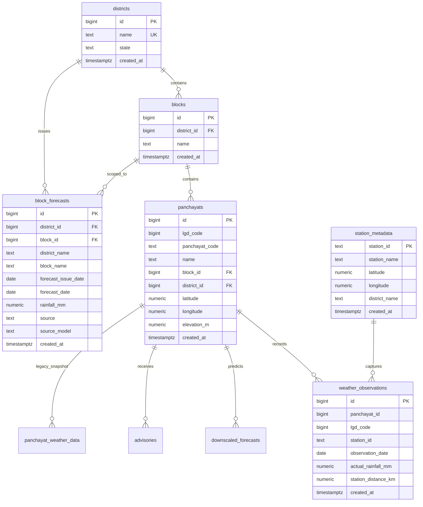

# GramSevak Multi-District Scalable Data Architecture & Ingestion Guide (Phase 1)

## Executive Summary

Phase 1 establishes a scalable, multi-district data architecture for **GramSevak**, transitioning from a single-district pilot (Nashik) to an enterprise-grade administrative hierarchy supporting **Nashik**, **Pune**, and future districts across Maharashtra and India.

The architecture ensures:
1. **Zero Downtime & Zero Regression**: Existing Nashik production tables (`panchayat_weather_data`, `downscaled_forecasts`, `advisories`) and endpoints remain 100% backward compatible and preserved without data loss.
2. **Normalized Relational Hierarchy**: Decouples geographic entities (`districts` → `blocks` → `panchayats`) from time-series weather streams (`weather_observations`, `block_forecasts`, `station_metadata`).
3. **Columnar High-Performance Parquet Storage**: All normalized datasets are stored in compressed Parquet format (`data/processed/`) for ML training and analytics.
4. **Repeatable & Idempotent Supabase Ingestion**: Reusable CLI pipeline (`scripts/process_weather_data.py`) with `--dry-run` simulation and conflict-safe PostgreSQL upserts.

---

## 1. Raw Datasets Audit & Comparison

### 1.1 Nashik Raw Dataset
- **Location**: `data/raw/nashik/nashik_panchayat_weather_raw.csv` (161 KB)
- **Encoding**: `latin1` / `cp1252` (contains non-breaking spaces `\xa0` in station and village names).
- **Dimensions**: 1,388 rows × 17 columns (includes trailing `Unnamed: 16` column with 100% nulls).
- **Panchayats & LGD**: 1,388 unique `panchayat_id` values (1001 to 2388); 1,283 unique `lgd_code` values (208 rows share LGD codes across sub-villages/hamlets).
- **Date Range**: 2026-01-09 to 2026-09-04 (9 unique forecast dates; single snapshot per panchayat).
- **Temporal Horizon**: `lead_days = 0` (issue date equals forecast target date).
- **Weather Stations**: 24 raw station labels (22 unique normalized AWS/ARG stations).

### 1.2 Pune Raw Dataset
- **Location**: `data/raw/pune/pune_original.csv` (24.95 MB)
- **Encoding**: `utf-8`.
- **Dimensions**: 187,320 rows × 16 columns.
- **Panchayats & LGD**: 1,338 unique `panchayat_id` values (`MH_27_PUNE_185262` .. `MH_27_PUNE_299397`); exactly 1,338 unique `lgd_code` values (1:1 bijection).
- **Spatio-Temporal Grid**: Complete panel dataset: 1,338 Panchayats × 140 daily timestamps = 187,320 records.
- **Date Range**: 2026-04-13 to 2026-09-23 (140 unique dates).
- **Temporal Horizon**: `lead_days = 1` (issue date 2026-04-12 to 2026-09-22; exactly 1 day lead time).
- **Weather Stations**: 23 unique NOAA/MeteoStat stations (e.g., `GHCND:IN012190101`, `METEOSTAT:43069`).

### 1.3 Key Differences & Harmonization Matrix

| Dimension | Nashik Dataset | Pune Dataset | Canonical Pipeline Harmonization |
| :--- | :--- | :--- | :--- |
| **File Size / Rows** | 161 KB / 1,388 rows | 24.95 MB / 187,320 rows | Scalable batch processing (batches of 5,000) |
| **Character Encoding** | `latin1` (non-breaking `\xa0`) | `utf-8` | Configuration-driven fallback decoder + sanitization |
| **Panchayat Coordinates** | `latitude`, `longitude` | `panchayat_latitude`, `panchayat_longitude` | Mapped uniformly to `panchayat_latitude`, `panchayat_longitude` |
| **Panchayat Identifier** | Integer (`1001` .. `2388`) | String (`MH_27_PUNE_185262`) | Trailing numeric extraction to stable `BIGINT` ID |
| **Administrative Casing**| Title Case (`Nashik`, `Baglan`) | Upper Case (`PUNE`, `HAVELI`) | Normalized to standard Title Case (`Pune`, `Haveli`) |
| **Lead Horizon** | `lead_days = 0` | `lead_days = 1` | Vectorized calculation: `date - forecast_issue_date` |
| **Extra Columns** | `Unnamed: 16` (empty) | None | Automatically pruned via `drop_columns` config |
| **Station Distance** | Max 0.98 km discrepancy vs Haversine | Max 0.025 km discrepancy vs Haversine | Audited and verified with Earth radius $R=6371.0\text{ km}$ |

---

## 2. Canonical Weather Schema

Every district dataset is converted into the following 17-field canonical schema:

| Column Name | Physical Data Type | Constraints & Range | Description |
| :--- | :--- | :--- | :--- |
| `panchayat_id` | `int64` / `BIGINT` | $\ge 1$ | Stable unique system identifier for the Gram Panchayat |
| `lgd_code` | `int64` / `BIGINT` | $\ge 1$ | Official Local Government Directory code |
| `panchayat_name` | `string` / `TEXT` | Non-empty, Title Case | Official Gram Panchayat administrative name |
| `block_name` | `string` / `TEXT` | Non-empty, Title Case | Administrative Block / Tehsil name |
| `district_name` | `string` / `TEXT` | Non-empty, Title Case | Administrative District name |
| `panchayat_latitude` | `float64` / `NUMERIC` | $[-90.0, 90.0]$ | WGS84 latitude coordinate (6 decimal precision) |
| `panchayat_longitude`| `float64` / `NUMERIC` | $[-180.0, 180.0]$ | WGS84 longitude coordinate (6 decimal precision) |
| `elevation_m` | `float64` / `NUMERIC` | $\ge 0$ | Elevation above mean sea level in meters |
| `date` | `string` / `DATE` | ISO `YYYY-MM-DD` | Target weather validity date |
| `forecast_issue_date`| `string` / `DATE` | ISO `YYYY-MM-DD` | Issue date of NWP regional forecast ($\le \text{date}$) |
| `lead_days` | `int64` / `BIGINT` | $\ge 0$ | Forecast horizon days ($\text{date} - \text{issue\_date}$) |
| `block_forecast_rainfall_mm` | `float64` / `NUMERIC` | $\ge 0.0$ | Regional NWP rainfall forecast issued at block level |
| `station_id` | `string` / `TEXT` | Non-empty, trimmed | Unique station code or identifier |
| `station_latitude` | `float64` / `NUMERIC` | $[-90.0, 90.0]$ | Weather station WGS84 latitude |
| `station_longitude` | `float64` / `NUMERIC` | $[-180.0, 180.0]$ | Weather station WGS84 longitude |
| `station_distance_km` | `float64` / `NUMERIC` | $\ge 0.0$ | Proximity distance from Panchayat centroid to station |
| `actual_rainfall_mm` | `float64` / `NUMERIC` | $\ge 0.0$ or `NULL` | Ground truth actual observed rainfall (sentinels converted to NULL) |

---

## 3. Data Normalization & Validation Rules

1. **No Hardcoded District Checks**:
   District variations are governed by `DistrictConfig` dataclasses in `data_pipeline/district_config.py`.
2. **Missing Observations are Preserved**:
   Missing actual ground precipitation is kept as `NULL` / `None`. **It is never fabricated or replaced with zero.**
3. **Invalid Rainfall Sentinels**:
   IMD/NOAA missing sentinel values (such as `-999.9`) or negative values are safely transformed into `NULL`.
4. **Haversine Distance Audit**:
   $$d = 2R \arcsin\left(\sqrt{\sin^2\left(\frac{\Delta \phi}{2}\right) + \cos(\phi_1)\cos(\phi_2)\sin^2\left(\frac{\Delta \lambda}{2}\right)}\right)$$
   Recalculated station distances are compared against the raw `station_distance_km`. Discrepancies are logged in the quality report without silently modifying raw observations.
5. **Temporal Consistency**:
   Enforces $\text{forecast\_issue\_date} \le \text{date}$, guaranteeing $\text{lead\_days} \ge 0$.

---

## 4. Parquet Columnar Data Architecture

All transformed datasets are saved in Apache Parquet format using Snappy compression (`index=False`):

```
data/
├── raw/
│   ├── nashik/
│   │   └── nashik_panchayat_weather_raw.csv   (161 KB)
│   └── pune/
│       └── pune_original.csv                  (24.95 MB)
│
├── processed/
│   ├── canonical_nashik.parquet               (1,388 rows, 17 columns)
│   ├── canonical_pune.parquet                 (187,320 rows, 17 columns)
│   ├── panchayats.parquet                     (2,726 unique panchayats)
│   ├── forecasts.parquet                      (1,873 unique block forecasts)
│   ├── observations.parquet                   (188,708 daily observations)
│   └── training_dataset.parquet               (188,708 ML-ready feature rows)
│
└── reports/
    ├── nashik_quality_report.json             (Machine-readable quality audit)
    ├── pune_quality_report.json               (Machine-readable quality audit)
    ├── nashik_import_report.json              (Supabase ingestion metrics)
    └── pune_import_report.json                (Supabase ingestion metrics)
```

### ML Training Dataset Specification (`training_dataset.parquet`)
Includes pre-computed spatial and temporal features ready for Phase 2 Downscaling ML model development:
- **Features**: `panchayat_id`, `lgd_code`, `district_name`, `block_name`, `panchayat_name`, `panchayat_latitude`, `panchayat_longitude`, `elevation_m`, `station_distance_km`, `date`, `forecast_issue_date`, `lead_days`, `month` (1-12), `day_of_year` (1-366), `block_forecast_rainfall_mm`.
- **Target**: `actual_rainfall_mm`.

---

## 5. Supabase Normalized Schema & Migration

The database schema evolves from flat tables into a normalized administrative hierarchy:



### Table Row Counts in Live Supabase
- **`districts`**: 2 (Nashik, Pune)
- **`blocks`**: 28 (15 Nashik, 13 Pune)
- **`panchayats`**: 2,726 (1,388 Nashik, 1,338 Pune)
- **`station_metadata`**: 45 (22 Nashik, 23 Pune)
- **`block_forecasts`**: 1,873 (53 Nashik, 1,820 Pune)
- **`weather_observations`**: 188,708 (1,388 Nashik, 187,320 Pune)
- **`panchayat_weather_data`** *(Backward Compatibility Snapshot)*: 2,726 (1,388 Nashik, 1,338 Pune)
- **`downscaled_forecasts`** *(Preserved)*: 381 records
- **`advisories`** *(Preserved)*: 1 record

---

## 6. Execution Commands

### 6.1 Dry-Run Verification (Safe, Zero DB Writes)
```bash
# Nashik Dry Run
python scripts/process_weather_data.py --district nashik --dry-run

# Pune Dry Run
python scripts/process_weather_data.py --district pune --dry-run
```

### 6.2 Live Supabase Ingestion
```bash
# Ingest Nashik
python scripts/process_weather_data.py --district nashik

# Ingest Pune (Full 187,320 observations)
python scripts/process_weather_data.py --district pune --batch-size 5000
```

---

## 7. Security, RLS & Performance

1. **Service Role Security**:
   - `SUPABASE_SERVICE_ROLE_KEY` is exclusively consumed in server-side ingestors and backend services.
   - It is never embedded in Vite React bundles or mobile Flutter assets.
2. **Row Level Security (RLS)**:
   - RLS is explicitly enabled on all public schema tables: `districts`, `blocks`, `panchayats`, `station_metadata`, `block_forecasts`, `weather_observations`.
   - Public read policies (`FOR SELECT USING (true)`) grant client applications read access without allowing unauthorized modifications.
3. **Database Indexing**:
   - Primary key lookup and foreign key joins are optimized via dedicated B-tree indexes:
     `idx_districts_name`, `idx_blocks_district_id`, `idx_panchayats_district_id`, `idx_panchayats_block_id`, `idx_panchayats_lgd_code`.
   - Spatio-temporal queries are accelerated via compound indexes:
     `idx_block_forecasts_district_block`, `idx_weather_obs_panchayat_date`.
