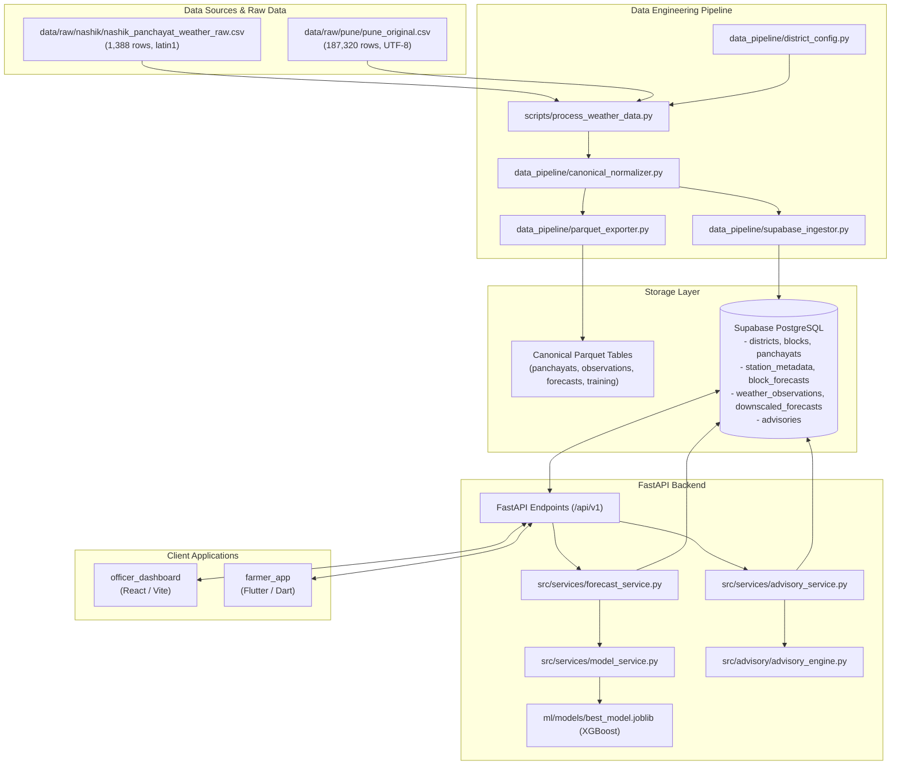

# GramSevak Phase 1.1: Repository and Existing Data Audit

**Date:** 2026-09-26  
**Auditor:** Antigravity AI Agent  
**Branch:** `phase-1-data-foundation`  
**Status:** Read-Only Audit Complete  

---

## 1. Repository Structure & Architecture Map

### 1.1 Directory Tree Overview
```text
sih26074-weather-downscaling/
├── advisory/                     # Domain documentation & advisory specifications
├── backend/                      # FastAPI Python Application
│   ├── app/
│   │   ├── api/v1/endpoints/     # REST routers: panchayats, forecast, advisories, farmer, officer
│   │   ├── core/                 # Config, DB engine, security, structured logging
│   │   ├── models/               # SQLAlchemy ORM models (normalized + legacy)
│   │   └── schemas/              # Pydantic v2 validation and serialization schemas
│   └── main.py                   # FastAPI application entrypoint & middleware
├── data/                         # Data Storage Engine
│   ├── features/                 # Generated ML feature matrices & train/test splits
│   ├── processed/                # Cleaned CSVs, canonical Parquet tables, consolidated files
│   ├── raw/                      # Original ground truth raw datasets (Nashik & Pune)
│   ├── reports/                  # Pipeline validation reports & ingestion audit JSONs
│   └── validation/               # Validation logs (geo, elevation, duplicate, station, etc.)
├── data_pipeline/                # Data Engineering & Ingestion Modules
│   ├── district_config.py        # Multi-district registry (Nashik, Pune)
│   ├── canonical_normalizer.py   # Multi-district normalization & schema validation
│   ├── parquet_exporter.py       # Columnar Parquet exporter & dataset consolidation
│   ├── supabase_ingestor.py      # Batch upsert engine for Supabase PostgreSQL
│   └── [legacy modules]          # cleaner, validators, baseline_builder, data_splitter
├── database/                     # Database Schema & Migrations
│   ├── migrations/               # PostgreSQL DDL migrations (identical to supabase/migrations)
│   └── README.md                 # Entity relationship & connection documentation
├── docs/                         # Architecture, audit, and design documentation
├── farmer_app/                   # Mobile Client (Flutter 3.x / Dart)
│   ├── lib/                      # Flutter app source (models, screens, widgets, repositories)
│   └── test/                     # Flutter integration and widget tests
├── ml/                           # Machine Learning Subsystem
│   ├── models/                   # Serialized model artifacts (joblib) & configs (JSON)
│   ├── preprocessing.py          # Time-aware split, feature transformations, scaling
│   ├── train.py                  # Reproducible training pipeline (RF & XGBoost)
│   ├── evaluate.py               # Evaluation against baseline, error distributions
│   └── predict.py                # Standalone inference CLI
├── officer_dashboard/            # Web Client (React 18 / TypeScript / Vite)
│   ├── src/
│   │   ├── components/           # UI components (AppShell, HierarchicalSelector, etc.)
│   │   ├── services/             # Typed API client (ApiService.ts) & mock store
│   │   └── types/                # TypeScript interface definitions
│   └── package.json              # Dashboard dependencies and scripts
├── scripts/                      # Operational Scripts & CLI utilities
│   └── process_weather_data.py   # Unified Multi-District CLI ingestion tool
├── src/                          # Shared Python Services
│   ├── advisory/                 # Rule engine, multilingual localizer, severity classifier
│   ├── services/                 # ForecastService, AdvisoryService, ModelService
│   ├── utils/                    # Geospatial mathematics (Haversine distance)
│   └── validation/               # Prediction validation & physical bounds enforcement
├── supabase/                     # Supabase project configuration & mirror migrations
└── tests/                        # Comprehensive test suite (24 pytest test modules)
```

### 1.2 Architecture Map


---

## 2. Nashik Data Audit

Every dataset related to Nashik was inspected. The files, locations, types, row counts, columns, purposes, and categories are cataloged below:

| # | File Path | File Type | Approximate Size | Row Count | Column Count | Purpose | Data Category |
|---|---|---|---|---|---|---|---|
| 1 | `data/raw/nashik_panchayat_weather_raw.csv` | CSV (latin1) | 161.2 KB | 1,388 | 17 | Root raw copy of Nashik Panchayat weather snapshot | Raw Data |
| 2 | `data/raw/nashik/nashik_panchayat_weather_raw.csv` | CSV (latin1) | 161.2 KB | 1,388 | 17 | Scoped subfolder copy (byte-identical to file #1) | Raw Data |
| 3 | `data/processed/nashik_weather_clean.csv` | CSV (UTF-8) | 164.4 KB | 1,388 | 16 | Standardized cleaned dataset, ISO dates, sentinels dropped | Processed Data |
| 4 | `data/processed/nashik_baseline_dataset.csv` | CSV (UTF-8) | 78.0 KB | 1,388 | 8 | IMD block forecast vs actual rainfall baseline evaluation | Processed / Eval |
| 5 | `data/processed/canonical_nashik.parquet` | Parquet | 55.5 KB | 1,388 | 17 | Columnar analytical version of clean Nashik records | Processed Data |
| 6 | `data/features/nashik_rainfall_features.csv` | CSV (UTF-8) | 157.2 KB | 1,388 | 17 | Feature matrix (lead_days, month, day_of_year, terrain) | Feature Data |
| 7 | `data/features/nashik_train.csv` | CSV (UTF-8) | 125.9 KB | 1,110 | 17 | 80% chronological train split (2026-01-09 to 2026-05-09) | ML Training Data |
| 8 | `data/features/nashik_test.csv` | CSV (UTF-8) | 31.5 KB | 278 | 17 | 20% chronological test split (2026-05-09 to 2026-09-04) | ML Test Data |

### Column Schemas for Nashik Datasets
- **Raw CSVs (`latitude`, `longitude`, trailing `Unnamed: 16`):**  
  `['panchayat_id', 'lgd_code', 'panchayat_name', 'block_name', 'district_name', 'latitude', 'longitude', 'elevation_m', 'date', 'forecast_issue_date', 'block_forecast_rainfall_mm', 'station_id', 'station_latitude', 'station_longitude', 'station_distance_km', 'actual_rainfall_mm', 'Unnamed: 16']`
- **Cleaned CSV (`panchayat_latitude`, `panchayat_longitude`, 16 fields):**  
  `['panchayat_id', 'lgd_code', 'panchayat_name', 'block_name', 'district_name', 'panchayat_latitude', 'panchayat_longitude', 'elevation_m', 'date', 'forecast_issue_date', 'block_forecast_rainfall_mm', 'station_id', 'station_latitude', 'station_longitude', 'station_distance_km', 'actual_rainfall_mm']`
- **Canonical Parquet:**  
  Same 16 fields + computed `lead_days`.
- **Training / Feature CSVs:**  
  `['panchayat_id', 'lgd_code', 'panchayat_name', 'block_name', 'district_name', 'station_id', 'date', 'forecast_issue_date', 'block_forecast_rainfall_mm', 'panchayat_latitude', 'panchayat_longitude', 'elevation_m', 'station_distance_km', 'lead_days', 'month', 'day_of_year', 'actual_rainfall_mm']`

---

## 3. Pune Dataset Audit

The Pune raw dataset was inspected directly without any modification:

- **File Path:** `data/raw/pune/pune_original.csv`
- **File Size:** 26,161,031 bytes (~24.95 MB)
- **Total Row Count:** 187,320 rows
- **Total Column Count:** 16 columns
- **Date Range:**
  - `date`: `2026-04-13` to `2026-09-23` (140 unique consecutive calendar days)
  - `forecast_issue_date`: `2026-04-12` to `2026-09-22` (140 unique days)
  - `lead_days`: Constant 1 day across all 187,320 records
- **Administrative Entities:**
  - District: 1 (`PUNE`, uppercase)
  - Unique Blocks: 13 (all uppercase, e.g., `AMBEGAON`, `HAVELI`, `JUNNAR`, `BARAMATI`, etc.)
  - Unique Panchayats: 1,338 Panchayats
  - Unique Weather Stations: 23 AWS stations
  - Cross-Product: $1,338 \text{ panchayats} \times 140 \text{ dates} = 187,320 \text{ records}$

### Pune Column Names and Data Types
| Column Name | Inferred Pandas Dtype | Sample Value | Notes |
|---|---|---|---|
| `panchayat_id` | `object` (string) | `'MH_27_PUNE_185262'` | String formatted as `MH_27_PUNE_<lgd_code>` |
| `lgd_code` | `int64` | `185262` | Standard government LGD code |
| `panchayat_name` | `object` (string) | `'AHUPE'` | Uppercase text |
| `block_name` | `object` (string) | `'AMBEGAON'` | Uppercase text |
| `district_name` | `object` (string) | `'PUNE'` | Uppercase text |
| `panchayat_latitude` | `float64` | `19.1234` | Geo latitude (WGS84) |
| `panchayat_longitude` | `float64` | `73.5678` | Geo longitude (WGS84) |
| `elevation_m` | `int64` | `650` | Terrain height in meters |
| `date` | `object` (string) | `'13-04-2026'` | Raw DD-MM-YYYY format |
| `forecast_issue_date` | `object` (string) | `'12-04-2026'` | Raw DD-MM-YYYY format |
| `block_forecast_rainfall_mm` | `float64` | `5.68` | Range: 0.0 to 12.4 mm (Mean: 5.68 mm) |
| `station_id` | `object` (string) | `'AWS_PUNE_01'` | Reference AWS weather station |
| `station_latitude` | `float64` | `19.1000` | Station latitude |
| `station_longitude` | `float64` | `73.5500` | Station longitude |
| `station_distance_km` | `float64` | `12.45` | Distance from Panchayat to Station |
| `actual_rainfall_mm` | `int64` / `float64` | `6` | Range: 0.0 to 120.3 mm (Mean: 6.18 mm) |

---

## 4. Supabase & Database Architecture Audit

### 4.1 Migration History
The database schema is defined in four migration scripts tracked identically in `database/migrations/` and `supabase/migrations/`:
1. `20260906000001_create_block_forecasts.sql`: Creates initial `block_forecasts` table with unique constraint and indexes.
2. `20260907000001_create_advisories.sql`: Creates `advisories` table with status tracking (`DRAFT`, `APPROVED`, `PUBLISHED`, `REJECTED`).
3. `20260925000001_multi_district_architecture.sql`: Creates normalized hierarchy (`districts`, `blocks`, `panchayats`, `station_metadata`, `weather_observations`), adds foreign keys, performance indexes, and enables RLS.
4. `20260925000002_hierarchical_indexes.sql`: Adds composite indexes (`idx_panchayats_block_name`, `idx_panchayats_block_id_id`, `idx_panchayats_district_name`) and functional index (`idx_panchayats_lower_name`).

### 4.2 Table Inventory & Entity Details

```
+-----------------------------------------------------------------------------------+
|                              ADMINISTRATIVE HIERARCHY                             |
+-----------------------------------------------------------------------------------+
|  [districts]                                                                      |
|    id (BIGINT PK)                                                                 |
|    name (TEXT UNIQUE)                                                             |
|    state (TEXT)                                                                   |
|         | 1                                                                       |
|         | N                                                                       |
|  [blocks]                                                                         |
|    id (BIGINT PK)                                                                 |
|    district_id (BIGINT FK -> districts.id)                                        |
|    name (TEXT)                                                                    |
|    CONSTRAINT: UNIQUE(district_id, name)                                          |
|         | 1                                                                       |
|         | N                                                                       |
|  [panchayats]                                                                     |
|    id (BIGINT PK)                                                                 |
|    lgd_code (BIGINT)                                                              |
|    panchayat_code (TEXT)                                                          |
|    name (TEXT)                                                                    |
|    block_id (BIGINT FK -> blocks.id)                                              |
|    district_id (BIGINT FK -> districts.id)                                        |
|    latitude (NUMERIC), longitude (NUMERIC), elevation_m (NUMERIC)                 |
+-----------------------------------------------------------------------------------+

+-----------------------------------------------------------------------------------+
|                              WEATHER OBSERVATIONS & NWP                           |
+-----------------------------------------------------------------------------------+
|  [station_metadata]                                                               |
|    station_id (TEXT PK), station_name, latitude, longitude, district_name         |
|                                                                                   |
|  [block_forecasts]                                                                |
|    id (BIGINT PK), district_id, block_id, district_name, block_name               |
|    forecast_issue_date (DATE), forecast_date (DATE), rainfall_mm (NUMERIC)        |
|    source (TEXT), source_model (TEXT)                                             |
|    CONSTRAINT: UNIQUE(district_name, block_name, forecast_issue_date,             |
|                       forecast_date, source_model)                                |
|                                                                                   |
|  [weather_observations]                                                           |
|    id (BIGINT PK), panchayat_id (BIGINT), lgd_code (BIGINT), station_id (TEXT)    |
|    observation_date (DATE), actual_rainfall_mm (NUMERIC)                          |
|    station_distance_km (NUMERIC)                                                  |
|    CONSTRAINT: UNIQUE(panchayat_id, observation_date)                             |
+-----------------------------------------------------------------------------------+

+-----------------------------------------------------------------------------------+
|                              ML PREDICTIONS & ADVISORIES                          |
+-----------------------------------------------------------------------------------+
|  [downscaled_forecasts]                                                           |
|    id (BIGINT PK), panchayat_id (BIGINT), forecast_date (DATE)                    |
|    forecast_issue_date (DATE), block_forecast_rainfall_mm (NUMERIC)               |
|    downscaled_rainfall_mm (NUMERIC), actual_rainfall_mm (NUMERIC)                 |
|    model_name (TEXT), model_version (TEXT), confidence (NUMERIC)                  |
|                                                                                   |
|  [advisories]                                                                     |
|    id (BIGINT PK), panchayat_id (BIGINT), forecast_id (BIGINT)                    |
|    forecast_date (DATE), rainfall_mm (NUMERIC), rainfall_category (TEXT)          |
|    severity (TEXT: LOW/MODERATE/HIGH/CRITICAL), advisory_title, advisory_text     |
|    rule_version (TEXT), status (TEXT: DRAFT/APPROVED/PUBLISHED/REJECTED)          |
|    officer_id (TEXT), officer_comment (TEXT), approved_at (TIMESTAMPTZ)           |
+-----------------------------------------------------------------------------------+

+-----------------------------------------------------------------------------------+
|                              LEGACY DENORMALIZED TABLE                            |
+-----------------------------------------------------------------------------------+
|  [panchayat_weather_data]                                                         |
|    panchayat_id (BIGINT PK), lgd_code, panchayat_name, block_name, district_name  |
|    panchayat_latitude, panchayat_longitude, elevation_m, date, forecast_issue_date|
|    block_forecast_rainfall_mm, station_id, station_lat, station_lon               |
|    station_distance_km, actual_rainfall_mm                                        |
+-----------------------------------------------------------------------------------+
```

### 4.3 Current Storage Architecture
- **Panchayat Storage:** Split between normalized `panchayats` table (1,388 Nashik + 1,338 Pune = 2,726 rows) and legacy flat `panchayat_weather_data` table (historical snapshot).
- **Forecast Storage:** Regional numerical forecasts reside in `block_forecasts` (1,873 rows total). Downscaled ML predictions reside in `downscaled_forecasts`.
- **Observation Storage:** Ground truth daily observations reside in `weather_observations` (188,708 rows total).
- **RLS Configuration:** Row-Level Security enabled on all 6 normalized tables with public read policies.

---

## 5. Existing Data Flow

The live data flow verified against actual codebase implementation is as follows:

```
[Raw CSV Datasets]
  ├─ data/raw/nashik/nashik_panchayat_weather_raw.csv (1,388 rows)
  └─ data/raw/pune/pune_original.csv (187,320 rows)
        │
        ▼
[Processing: scripts/process_weather_data.py]
  ├─ Reads configuration from data_pipeline/district_config.py
  ├─ Normalizes fields & handles encoding (canonical_normalizer.py)
  ├─ Computes lead_days & validates Haversine distance
  ├─ Writes quality reports to data/reports/<district>_quality_report.json
  ├─ Exports Parquet files (data/processed/canonical_<district>.parquet)
  └─ Ingests into Supabase (data_pipeline/supabase_ingestor.py)
        │
        ▼
[Supabase PostgreSQL Database]
  ├─ Normalized: districts, blocks, panchayats, station_metadata
  ├─ Time-series: block_forecasts, weather_observations
  └─ Legacy snapshot: panchayat_weather_data
        │
        ▼
[FastAPI Backend: backend/app/]
  ├─ GET /api/v1/districts -> queries districts
  ├─ GET /api/v1/districts/{id}/blocks -> queries blocks
  ├─ GET /api/v1/blocks/{id}/panchayats -> queries panchayats
  ├─ GET /api/v1/panchayats -> queries panchayat_weather_data (with fallback)
  └─ POST /api/v1/forecast/generate -> invokes ForecastService
        │
        ▼
[ML Inference: src/services/forecast_service.py & model_service.py]
  ├─ Extracts Panchayat elevation, coords, and station distance from DB
  ├─ Fetches block forecast for date
  ├─ Computes calendar features (month, day_of_year, lead_days)
  ├─ Predicts downscaled rainfall with ml/models/best_model.joblib (XGBoost)
  ├─ Enforces physical non-negativity constraint (max(0.0, raw_pred))
  └─ Stores prediction in Supabase table downscaled_forecasts
        │
        ▼
[Advisory Engine: src/services/advisory_service.py & src/advisory/]
  ├─ Reads downscaled prediction from downscaled_forecasts
  ├─ Classifies rainfall intensity (IMD categories: Light, Moderate, Heavy, etc.)
  ├─ Generates rule-based farming actions & severity (LOW, MODERATE, HIGH, CRITICAL)
  ├─ Localizes to Marathi / Hindi / English (localization.py)
  └─ Stores draft advisory in Supabase advisories table (status: DRAFT)
        │
        ├─────────────────────────────────────────────────┐
        ▼                                                 ▼
[Web: officer_dashboard (React)]          [Mobile: farmer_app (Flutter)]
  ├─ Hierarchical selector (Dist -> Blk -> GP)       ├─ Selects registered Panchayat
  ├─ Reviews downscaled forecasts                    ├─ GET /api/v1/farmer/forecast
  ├─ Reviews DRAFT advisories                        ├─ Displays approved advisory & rainfall
  └─ Approves or Rejects (status: APPROVED/REJECTED) └─ Offline cache fallback for pilot
```

---

## 6. District-Specific Assumptions & Hardcoded Logic

An audit across the entire codebase revealed 346 references to district names, specific blocks, or pilot IDs. The primary hardcoded assumptions requiring attention are:

| File Path | Component / Line | Hardcoded Logic | Reason it is District-Specific |
|---|---|---|---|
| `data_pipeline/cleaner.py` | Line 32, 76-77 | `input_path = "data/raw/nashik_panchayat_weather_raw.csv"`, `df = df[df["district_name"].str.strip().str.lower() == "nashik"]` | Hardcoded to only process Nashik; silences or discards any other district. |
| `data_pipeline/geo_validator.py` | Lines 8-11, 86-90 | `NASHIK_LAT_MIN, NASHIK_LAT_MAX = 19.0, 21.0`, `NASHIK_LON_MIN, NASHIK_LON_MAX = 73.0, 75.2` | Emits warnings if coordinates fall outside Nashik bounding box. |
| `data_pipeline/elevation_validator.py` | Lines 10-15 | `NASHIK_ELEVATION_MIN = 200`, `NASHIK_ELEVATION_MAX = 1600` | Bounded specifically to Nashik topography; Pune elevations trigger warnings. |
| `data_pipeline/station_validator.py` | Lines 12-18 | Expected station count = 24 | Assumes Nashik's 24 weather stations. Pune has 23 stations. |
| `data_pipeline/baseline_builder.py` | Lines 15-18 | Input path `data/processed/nashik_weather_clean.csv` | Hardcoded Nashik file path. |
| `data_pipeline/supabase_loader.py` | Lines 15-20 | Input path `data/processed/nashik_weather_clean.csv` | Loads only Nashik data into `panchayat_weather_data`. |
| `backend/app/api/v1/endpoints/panchayats.py` | Line 35, 210-212 | `PROCESSED_DATA_PATH = Path("data/processed/nashik_weather_clean.csv")` | Fallback store on DB connection failure only contains Nashik. |
| `backend/app/api/v1/endpoints/panchayats.py` | Lines 41-47 | OpenAPI docstring: "List Nashik District Panchayats" | API documentation assumes single pilot district. |
| `backend/app/schemas/panchayat.py` | Lines 13, 40-42 | Docstring: "Schema representing a single Gram Panchayat in Nashik district" | Schema documentation explicitly refers to Nashik. |
| `backend/app/schemas/forecast.py` | Lines 22, 60 | Default `panchayat_id = 1001`, `block_name = "Baglan"` | Schema examples default exclusively to Nashik. |
| `src/services/forecast_service.py` | Lines 24-25, 118-120 | Paths to `nashik_test.csv`, `nashik_weather_clean.csv`, `nashik_train.csv` | File fallback in `get_panchayat_record_from_dataset()` only loads Nashik. |
| `ml/train.py` | Line 81 | `train_path = "data/features/nashik_train.csv"` | Default training dataset points to Nashik. |
| `officer_dashboard/src/services/mockData.ts` | Lines 3-100+ | 10 mock Panchayats all located in Baglan, Nashik | Offline mock store does not represent Pune. |
| `officer_dashboard/src/services/api.ts` | Lines 183-186, 198-200 | Fallback districts: `[{ id: 1, name: 'Nashik' }, { id: 4, name: 'Pune' }]`, fallback blocks: `Baglan`, `Dindori`, `Surgana` | Fallback blocks only contain Nashik blocks. |
| `farmer_app/lib/repositories/farmer_repository.dart` | Lines 14-55, 87-91 | Fallback Panchayats: IDs 1001, 1002, 1008, 1005 (Baglan, Nashik) | Offline fallback contains only Nashik pilot Panchayats. |

---

## 7. Existing ML & Data Pipeline Audit

### 7.1 Data Pipelines
There are currently two coexisting pipelines in the repository:
1. **Legacy Nashik Pipeline (`data_pipeline/run_pipeline.py`):**
   - Single-district monolithic flow designed for Nashik pilot.
   - Outputs: `nashik_weather_clean.csv`, `nashik_rainfall_features.csv`, `nashik_train.csv` (1,110 rows), `nashik_test.csv` (278 rows).
   - Ingests into `panchayat_weather_data` table via `supabase_loader.py`.
2. **Modern Multi-District Pipeline (`scripts/process_weather_data.py`):**
   - Config-driven via `data_pipeline/district_config.py`.
   - Normalizes text, dates, coordinates, and extracts numeric IDs via `canonical_normalizer.py`.
   - Generates consolidated Parquet tables via `parquet_exporter.py`:
     - `panchayats.parquet` (2,726 rows: 1,388 Nashik + 1,338 Pune)
     - `observations.parquet` (188,708 rows: 1,388 Nashik + 187,320 Pune)
     - `forecasts.parquet` (1,873 rows: 53 Nashik + 1,820 Pune)
     - `training_dataset.parquet` (188,708 rows)
   - Ingests into normalized Supabase hierarchy via `supabase_ingestor.py`.

### 7.2 Machine Learning Model
- **Current Model:** XGBoost Regressor (`ml/models/best_model.joblib`), configuration in `ml/models/best_model_config.json`.
- **Training Source:** Exclusively Nashik data (`data/features/nashik_train.csv`, 1,110 rows).
- **Features Used (8):**
  1. `block_forecast_rainfall_mm`
  2. `panchayat_latitude`
  3. `panchayat_longitude`
  4. `elevation_m`
  5. `station_distance_km`
  6. `lead_days`
  7. `month`
  8. `day_of_year`
- **Model Performance on Held-Out Test Set (Nashik, 278 rows):**
  - Baseline IMD Forecast MAE: 5.4165 mm, RMSE: 6.6747 mm
  - XGBoost Model MAE: 5.5599 mm, RMSE: 8.7720 mm
  - *Note:* The model has not yet been retrained on the 187,320 Pune observations.

---

## 8. Current Git State

- **Active Branch:** `phase-1-data-foundation`
- **Working Tree:** Clean (verified via `git status`)
- **Untracked Files:** None
- **Active User Changes:** None discarded, repository state fully preserved

---

## 9. Risks Discovered

1. **Panchayat ID Incompatibility & Type Conflict:**
   - Nashik uses integer IDs (`1001`, `1002`, etc.).
   - Pune raw uses string IDs (`'MH_27_PUNE_185262'`).
   - The Supabase schema defines `panchayats.id` as `BIGINT`. While `default_panchayat_id_extractor` in `district_config.py` successfully extracts `185262` (the LGD code), any pipeline bypassing this extractor will fail with a Postgres type error.
2. **Silent Row Filtering in Legacy Cleaner:**
   - `data_pipeline/cleaner.py` line 77 explicitly drops any row where `district_name != 'nashik'`. Running legacy scripts on Pune data results in an empty dataset without an explicit error.
3. **Encoding Hazards:**
   - `nashik_panchayat_weather_raw.csv` contains `0xa0` (non-breaking spaces) and fails with UTF-8 decoders without `latin1` / `cp1252` fallback.
   - `pune_original.csv` is standard UTF-8.
4. **Casing & Naming Discrepancies:**
   - Pune raw contains all-caps text (`PUNE`, `AMBEGAON`, `AHUPE`).
   - Nashik raw contains title-case text (`Nashik`, `Baglan`, `Ajmer Saundane`).
   - Case-insensitive matching is mandatory across all SQL queries, API endpoints, and frontend selectors.
5. **Cold-Start / Offline Fallback Skew:**
   - Frontend (`officer_dashboard`) and mobile app (`farmer_app`) fallbacks contain hardcoded Baglan/Nashik panchayats. If the live backend is unreachable, the UI appears strictly Nashik-focused.
6. **ML Generalization Gap:**
   - The active model was trained on only 1,110 rows from Nashik. The 187,320 Pune observations represent 99.3% of all ground truth observations in the project, but are not yet utilized in the active production model.

---

## 10. Recommended Next Step

**Proceed to Phase 1.2:**  
Unify the data pipeline around `district_config.py` and `canonical_normalizer.py`, deprecate legacy Nashik-only cleaning filters, verify clean schema alignment across both districts, and prepare the foundation for multi-district model training without risking existing production stability.
