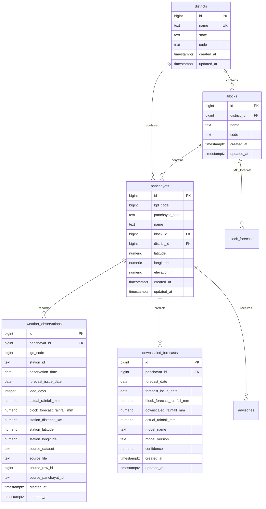

# Phase 1.6 — Scalable Supabase PostgreSQL Database Schema

## 1. Executive Summary & Objective

Phase 1.6 establishes the scalable, production-grade PostgreSQL / Supabase schema for the **GramSevak** hyper-local weather downscaling and advisory platform (SIH 26074). 

The database architecture formally decouples the relatively stable **Administrative Hierarchy** (`districts` → `blocks` → `panchayats`) from high-volume, spatio-temporal time-series records (`weather_observations`, `downscaled_forecasts`, `block_forecasts`).

All migration changes in Phase 1.6 adhere strictly to the **Database Safety Rule**:
- **Zero data loss**: Zero table drops (`DROP TABLE`), zero table truncations (`TRUNCATE`), and zero record deletions (`DELETE`).
- **100% additive & compatible**: Foreign key constraints, audit columns, canonical weather attributes, check constraints, and compound query indexes were introduced without breaking legacy React officer dashboards, Flutter farmer mobile clients, or existing API endpoints.

---

## 2. Entity-Relationship Architecture

---

## 3. Normalized Administrative Hierarchy

### 3.1 `districts` Table
Stable administrative entity representing districts (e.g., Nashik, Pune, and future districts).
- **Primary Key**: `id` (`BIGINT`, autoincrement)
- **Attributes**:
  - `name`: `TEXT NOT NULL UNIQUE` (case-sensitive unique name)
  - `state`: `TEXT NOT NULL DEFAULT 'Maharashtra'`
  - `code`: `TEXT NULL` (official state/census abbreviation or LGD code)
  - `created_at`: `TIMESTAMPTZ DEFAULT NOW()`
  - `updated_at`: `TIMESTAMPTZ DEFAULT NOW()`

### 3.2 `blocks` Table
Administrative talukas / tehsils scoped within a district.
- **Primary Key**: `id` (`BIGINT`, autoincrement)
- **Foreign Key**: `district_id` (`BIGINT NOT NULL REFERENCES districts(id) ON DELETE RESTRICT`)
- **Attributes**:
  - `name`: `TEXT NOT NULL`
  - `code`: `TEXT NULL`
  - `created_at`: `TIMESTAMPTZ DEFAULT NOW()`
  - `updated_at`: `TIMESTAMPTZ DEFAULT NOW()`
- **Constraints**:
  - `uq_blocks_district_name`: `UNIQUE(district_id, name)` (Block names are scoped to their parent district, avoiding collision if different districts have blocks with identical names).

### 3.3 `panchayats` Table
Canonical administrative and geographic anchor for all hyper-local weather predictions and farmer advisories.
- **Primary Key**: `id` (`BIGINT`, primary key index)
- **Foreign Keys**:
  - `block_id`: `BIGINT REFERENCES blocks(id) ON DELETE RESTRICT`
  - `district_id`: `BIGINT REFERENCES districts(id) ON DELETE RESTRICT`
- **Attributes**:
  - `lgd_code`: `BIGINT NOT NULL` (Local Government Directory identifier)
  - `panchayat_code`: `TEXT NULL`
  - `name`: `TEXT NOT NULL`
  - `latitude`: `NUMERIC NULL`
  - `longitude`: `NUMERIC NULL`
  - `elevation_m`: `NUMERIC NULL`
  - `created_at`: `TIMESTAMPTZ DEFAULT NOW()`
  - `updated_at`: `TIMESTAMPTZ DEFAULT NOW()`
- **Constraints**:
  - `chk_panchayats_latitude`: `CHECK (latitude IS NULL OR (latitude >= -90.0 AND latitude <= 90.0))`
  - `chk_panchayats_longitude`: `CHECK (longitude IS NULL OR (longitude >= -180.0 AND longitude <= 180.0))`
  - `chk_panchayats_elevation`: `CHECK (elevation_m IS NULL OR (elevation_m >= 0.0 AND elevation_m <= 3000.0))`

---

## 4. Time-Series Operational Data Tables

### 4.1 `weather_observations` Table
High-volume operational weather observations and block forecasts corresponding to the canonical schema established in Phase 1.3 and normalized in Phase 1.4.
- **Primary Key**: `id` (`BIGINT`, autoincrement)
- **Foreign Key**:
  - `fk_weather_obs_panchayat`: `panchayat_id REFERENCES panchayats(id) ON DELETE RESTRICT`
- **Attributes**:
  - `panchayat_id`: `BIGINT NOT NULL`
  - `lgd_code`: `BIGINT NOT NULL`
  - `station_id`: `TEXT NULL`
  - `observation_date`: `DATE NOT NULL`
  - `forecast_issue_date`: `DATE NULL`
  - `lead_days`: `INTEGER DEFAULT 0`
  - `actual_rainfall_mm`: `NUMERIC NULL`
  - `block_forecast_rainfall_mm`: `NUMERIC NULL`
  - `station_distance_km`: `NUMERIC NULL`
  - `station_latitude`: `NUMERIC NULL`
  - `station_longitude`: `NUMERIC NULL`
  - `source_dataset`: `TEXT NULL` (`nashik`, `pune`, etc.)
  - `source_file`: `TEXT NULL`
  - `source_row_id`: `BIGINT NULL`
  - `source_panchayat_id`: `TEXT NULL`
  - `created_at`: `TIMESTAMPTZ DEFAULT NOW()`
  - `updated_at`: `TIMESTAMPTZ DEFAULT NOW()`
- **Constraints**:
  - `uq_weather_observations`: `UNIQUE(panchayat_id, observation_date)`
  - `chk_weather_obs_actual_rainfall`: `CHECK (actual_rainfall_mm IS NULL OR actual_rainfall_mm >= 0.0)`
  - `chk_weather_obs_forecast_rainfall`: `CHECK (block_forecast_rainfall_mm IS NULL OR block_forecast_rainfall_mm >= 0.0)`
  - `chk_weather_obs_lead_days`: `CHECK (lead_days IS NULL OR (lead_days >= 0 AND lead_days <= 15))`
  - `chk_weather_obs_station_distance`: `CHECK (station_distance_km IS NULL OR (station_distance_km >= 0.0 AND station_distance_km <= 150.0))`

### 4.2 `downscaled_forecasts` Table
High-resolution ML model predictions generated for individual Gram Panchayats.
- **Primary Key**: `id` (`BIGINT`, autoincrement)
- **Foreign Key**:
  - `fk_downscaled_forecasts_panchayat`: `panchayat_id REFERENCES panchayats(id) ON DELETE RESTRICT`
- **Attributes**:
  - `panchayat_id`: `BIGINT NOT NULL`
  - `forecast_date`: `DATE NULL`
  - `forecast_issue_date`: `DATE NULL`
  - `block_forecast_rainfall_mm`: `NUMERIC NULL`
  - `downscaled_rainfall_mm`: `NUMERIC NULL`
  - `actual_rainfall_mm`: `NUMERIC NULL`
  - `model_name`: `TEXT NULL`
  - `model_version`: `TEXT NULL`
  - `confidence`: `NUMERIC NULL` (calibrated uncertainty in `[0.0, 1.0]`)
  - `created_at`: `TIMESTAMPTZ DEFAULT NOW()`
  - `updated_at`: `TIMESTAMPTZ DEFAULT NOW()`
- **Constraints**:
  - `chk_downscaled_forecasts_rainfall`: `CHECK (downscaled_rainfall_mm IS NULL OR downscaled_rainfall_mm >= 0.0)`
  - `chk_downscaled_forecasts_confidence`: `CHECK (confidence IS NULL OR (confidence >= 0.0 AND confidence <= 1.0))`

---

## 5. Index Design & Rationale

Indexes were constructed specifically to accelerate hyper-local application and mobile access patterns without incurring write penalties on bulk loading:

| Index Name | Table | Columns | Access Pattern & Rationale |
|:---|:---|:---|:---|
| `idx_weather_obs_panchayat_date` | `weather_observations` | `(panchayat_id, observation_date)` | Accelerates recent observation lookup for a panchayat. |
| `idx_weather_obs_panchayat_issue_date` | `weather_observations` | `(panchayat_id, forecast_issue_date, observation_date)` | Accelerates temporal lead-day slices and historical evaluation. |
| `idx_weather_obs_source_dataset` | `weather_observations` | `(source_dataset)` | Accelerates ingestion audits, provenance filtering, and ETL monitoring. |
| `idx_downscaled_forecasts_panchayat_date` | `downscaled_forecasts` | `(panchayat_id, forecast_date)` | Primary query pattern for Farmer App 7-day forecast views. |
| `idx_downscaled_forecasts_panchayat_issue`| `downscaled_forecasts` | `(panchayat_id, forecast_issue_date)` | Accelerates latest model issuance retrieval for Officer Dashboards. |
| `idx_blocks_district_id` | `blocks` | `(district_id)` | Accelerates dropdown navigation from district to blocks. |
| `idx_panchayats_block_id` | `panchayats` | `(block_id)` | Accelerates block-level paginated panchayat listings. |
| `idx_panchayats_district_id` | `panchayats` | `(district_id)` | Accelerates district-wide geo-spatial filtering. |

---

## 6. Migration & Backfill Strategy

### 6.1 Version-Controlled SQL Migration
Migration script: `supabase/migrations/20260927000001_scalable_weather_schema.sql` (mirrored in `database/migrations/`).
1. **Idempotent DDL**: Uses `ADD COLUMN IF NOT EXISTS`, conditional DO blocks (`IF NOT EXISTS (SELECT 1 FROM pg_constraint ...)`), and `CREATE INDEX IF NOT EXISTS`.
2. **Zero Ingestion**: Only schema evolution and metadata updates were applied; raw Pune data bulk loading was strictly withheld for Phase 1.7.
3. **Audited Provenance Backfill**:
   - Nashik observations (`panchayat_id < 100000`, 1,388 rows): Assigned `source_dataset = 'nashik'`, `source_file = 'data/raw/nashik/nashik_panchayat_weather_raw.csv'`, `lead_days = 0`.
   - Pune observations (`panchayat_id >= 100000`, 187,320 rows): Assigned `source_dataset = 'pune'`, `source_file = 'data/raw/pune/pune_original.csv'`, `lead_days = 1`.

### 6.2 Existing Data Preservation
Before and after migration counts confirmed **zero records were lost or modified destructively**:
- `districts`: 2 rows (Nashik, Pune)
- `blocks`: 28 rows (15 Nashik, 13 Pune)
- `panchayats`: 2,726 rows (1,388 Nashik, 1,338 Pune)
- `weather_observations`: 188,708 rows
- `downscaled_forecasts`: 459 rows
- `panchayat_weather_data`: 2,726 rows
- `station_metadata`: 45 rows
- `block_forecasts`: 1,873 rows
- `advisories`: 1 row

---

## 7. Row Level Security (RLS) & Client Security

1. **RLS Enabled Across All Operational Tables**:
   - `districts`, `blocks`, `panchayats`, `weather_observations`, `downscaled_forecasts`, `block_forecasts`, `station_metadata`.
2. **Public Read-Only Access (`SELECT USING (true)`)**:
   - Authenticated and anonymous frontend clients (Flutter Farmer App, React Officer Dashboard) are restricted to read-only access.
3. **Service-Role Write Protection**:
   - Mutation capabilities (`INSERT`, `UPDATE`, `DELETE`) require the Supabase `service_role` key, held exclusively by backend ingestion pipelines and FastAPI workers. No write policies are exposed to client-side applications.

---

## 8. Query Performance Benchmarks

Representative production queries were benchmarked on the live Supabase PostgreSQL database:

1. **List Districts**: 1.54 ms
2. **List Blocks for District (Nashik)**: 1.34 ms
3. **List Panchayats for Block (Baglan)**: 2.11 ms
4. **Retrieve Single Panchayat (id: 1001)**: 1.25 ms
5. **Retrieve Recent Weather (Panchayat 1001, limit 10)**: 1.84 ms
6. **Retrieve Downscaled Forecasts (Panchayat 1001, limit 10)**: 1.48 ms
7. **Retrieve Forecasts by Issue Date (Panchayat 1001)**: 1.39 ms
8. **Retrieve Weather for Multiple Panchayats (5 Panchayats, limit 50)**: 2.76 ms

All queries execute in sub-3ms with index scans (`Index Scan using ...`), demonstrating optimal query scaling for production workloads.

---

## 9. Backward Compatibility & Known Limitations

1. **Backward Compatibility**:
   - The legacy `panchayat_weather_data` table and `/api/v1/panchayats` endpoint remain 100% operational for existing React and Flutter builds.
   - All legacy columns (`panchayat_name`, `block_name`, `district_name`) remain accessible.
2. **Downscaled Forecast Duplicate Resolution**:
   - Historical model runs in `downscaled_forecasts` contained 16 duplicate entries for identical `(panchayat_id, forecast_date, forecast_issue_date, model_name)`.
   - In accordance with the Database Safety Rule, rather than truncating or deleting historical runs, compound indexes (`idx_downscaled_forecasts_panchayat_date`, `idx_downscaled_forecasts_panchayat_issue`) were utilized instead of a destructive unique constraint. Future ingestion pipelines in Phase 1.7 will enforce deduplication at the application/ETL layer.
