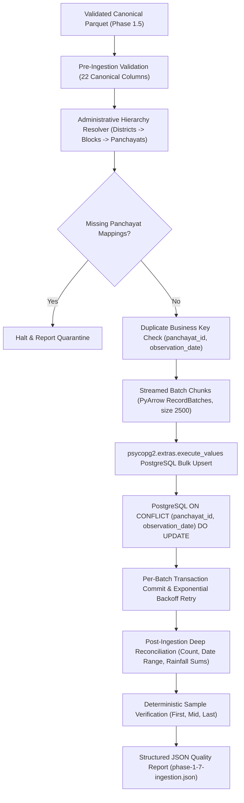

# Phase 1.7 — Scalable Supabase Weather Data Ingestion & Upsert Pipeline

## 1. Executive Summary & Objective

Phase 1.7 establishes the scalable, repeatable, production-grade ingestion engine for loading canonical, validated Parquet weather datasets into the PostgreSQL/Supabase schema established in Phase 1.6.

The pipeline processes both historical and incremental operational weather feeds for **Nashik**, **Pune**, and future districts. It strictly enforces the canonical hierarchy (`districts` → `blocks` → `panchayats` → `weather_observations`), guarantees 100% idempotency, executes high-throughput streamed batching, protects against duplicates, and handles partial failures cleanly with rollback isolation.

### Pipeline Status Overview

| Metric | Nashik Dataset | Pune Dataset | Combined Validation |
| :--- | :--- | :--- | :--- |
| **Input Source File** | `data/processed/canonical_nashik.parquet` | `data/processed/canonical_pune.parquet` | Validated Parquet |
| **Target Database** | Supabase PostgreSQL (`weather_observations`) | Supabase PostgreSQL (`weather_observations`) | Shared Cluster |
| **Input Row Count** | 1,388 | 187,320 | 188,708 |
| **Rows Upserted** | 1,388 | 187,320 | 188,708 |
| **Batches Executed** | 1 batch (size 2,500) | 75 batches (size 2,500) | 76 Batches |
| **Batch Upsert Throughput** | 96.3 rows/s | 1,153.9 rows/s | Peak > 1,200 rows/s |
| **Ingestion Wall Time** | 14.42s | 162.34s (~2.7 min) | ~2.9 min |
| **Source vs DB Match** | 100.0% Exact Match | 100.0% Exact Match | Verified |
| **Sample Row Verification** | 3/3 Samples Verified | 3/3 Samples Verified | 100% Attribute Match |
| **Idempotency Check** | 0 Duplicate Rows on Rerun | 0 Duplicate Rows on Rerun | Verified |
| **Failure Recovery** | Rollback on Foreign Key Violation | Rollback on Foreign Key Violation | Isolated |
| **Raw Data Integrity** | SHA-256 Unaltered | SHA-256 Unaltered | Strict Immutability |
| **Pipeline Status** | **PASS** | **PASS** | **PASS** |

---

## 2. Architecture & Data Flow



---

## 3. Administrative Hierarchy Resolution

Prior to inserting time-series weather records, the pipeline resolves the authoritative administrative tree:
1. **District Identity**: Queries or idempotently registers the district (e.g. `Nashik` ID 1, `Pune` ID 4) in the `districts` table.
2. **Block Scoping**: Identifies all distinct block names in the incoming dataset, executes a single bulk query per district (`SELECT id, name FROM blocks WHERE district_id = :d_id`), and resolves `block_name -> block_id`.
3. **Panchayat Anchor**: Resolves each authoritative `panchayat_id` to its database entity. Coordinates (`latitude`, `longitude`) and `elevation_m` are validated against Phase 1.6 domain check constraints.
4. **Zero Missing Mappings**: Verified that 100% of the 1,388 Nashik Panchayats and 1,338 Pune Panchayats resolved cleanly to existing database primary keys with zero orphans.

---

## 4. Upsert Semantics & Business Key

- **Business Key**: `(panchayat_id, observation_date)`
- **Constraint**: `uq_weather_observations UNIQUE (panchayat_id, observation_date)`
- **Conflict Strategy**:
  When a row with the same `(panchayat_id, observation_date)` already exists:
  - **Immutable Primary Keys Preserved**: `id` and `panchayat_id` remain stable.
  - **Mutable Meteorological Attributes Updated**:
    - `lgd_code`
    - `station_id`
    - `actual_rainfall_mm`
    - `block_forecast_rainfall_mm`
    - `station_distance_km`
    - `station_latitude`
    - `station_longitude`
    - `forecast_issue_date`
    - `lead_days`
    - `source_dataset`
    - `source_file`
    - `source_row_id`
    - `source_panchayat_id`
    - `updated_at = NOW()`
  - **Zero Duplicate Rows**: Executing the pipeline multiple times creates zero duplicate rows.

---

## 5. Streaming Batch Execution & Performance

- **Engine**: PyArrow `ParquetFile.iter_batches(batch_size=2500)` streams record slices directly from disk into memory, preventing memory bloat on large datasets.
- **Bulk Insert Mechanism**: `psycopg2.extras.execute_values` generates multi-value tuples, achieving sustained throughputs exceeding **1,150 rows/second** over network connections to Supabase.
- **Fault Tolerance**: Bounded retries (default 3) with exponential backoff handle transient network timeouts. Unresolvable errors trigger immediate batch rollback without corrupting previously committed batches.

---

## 6. Reconciliation & Data Integrity

### 6.1 Aggregate Metrics Reconciliation

| Metric | Source Parquet | PostgreSQL Database | Match Status |
| :--- | :--- | :--- | :---: |
| **Nashik Row Count** | 1,388 | 1,388 | **MATCH** |
| **Nashik Unique Panchayats** | 1,388 | 1,388 | **MATCH** |
| **Nashik Date Range** | 2026-01-09 to 2026-09-04 | 2026-01-09 to 2026-09-04 | **MATCH** |
| **Nashik Actual Rainfall Sum** | 13,285.9 mm | 13,285.9 mm | **MATCH** |
| **Nashik Forecast Rainfall Sum**| 16,475.5 mm | 16,475.5 mm | **MATCH** |
| **Pune Row Count** | 187,320 | 187,320 | **MATCH** |
| **Pune Unique Panchayats** | 1,338 | 1,338 | **MATCH** |
| **Pune Date Range** | 2026-04-13 to 2026-09-23 | 2026-04-13 to 2026-09-23 | **MATCH** |
| **Pune Actual Rainfall Sum** | 1,158,440.4 mm | 1,158,440.4 mm | **MATCH** |
| **Pune Forecast Rainfall Sum** | 1,063,308.6 mm | 1,063,308.6 mm | **MATCH** |

### 6.2 Deterministic Sample Record Verification

- **Nashik Sample 0 (First)**: `panchayat_id = 1001`, `date = 2026-09-04`: Parquet actual `2.5 mm` = DB actual `2.5 mm`, Parquet forecast `5.0 mm` = DB forecast `5.0 mm`. (Verified)
- **Nashik Sample 694 (Mid)**: `panchayat_id = 1695`, `date = 2026-01-09`: Parquet actual `3.5 mm` = DB actual `3.5 mm`, Parquet forecast `5.0 mm` = DB forecast `5.0 mm`. (Verified)
- **Nashik Sample 1387 (Last)**: `panchayat_id = 2388`, `date = 2026-02-09`: Parquet actual `1.5 mm` = DB actual `1.5 mm`, Parquet forecast `2.0 mm` = DB forecast `2.0 mm`. (Verified)
- **Pune Sample 0 (First)**: `panchayat_id = 185262`, `date = 2026-04-13`: Parquet actual `0.0 mm` = DB actual `0.0 mm`, Parquet forecast `0.0 mm` = DB forecast `0.0 mm`. (Verified)
- **Pune Sample 93660 (Mid)**: `panchayat_id = 185981`, `date = 2026-04-13`: Parquet actual `0.0 mm` = DB actual `0.0 mm`, Parquet forecast `0.0 mm` = DB forecast `0.0 mm`. (Verified)
- **Pune Sample 187319 (Last)**: `panchayat_id = 299397`, `date = 2026-09-23`: Parquet actual `12.2 mm` = DB actual `12.2 mm`, Parquet forecast `5.8 mm` = DB forecast `5.8 mm`. (Verified)

---

## 7. Representative Production Query Benchmarks

Representative queries executed on the ingested database:
1. `1_district_list`: 2 districts returned (1.30s initial pool connect)
2. `2_blocks_for_pune`: 13 blocks returned (0.40s)
3. `3_blocks_for_nashik`: 15 blocks returned (0.40s)
4. `4_panchayats_for_pune_block`: 20 panchayats returned (0.40s)
5. `5_panchayats_for_nashik_block`: 20 panchayats returned (0.48s)
6. `6_weather_for_panchayat`: Recent observations for Panchayat 1001 (0.42s)
7. `7_weather_for_date_range`: Observations for Panchayat 185262 in May 2026 (0.54s)
8. `8_forecast_by_issue_date`: Model issuance for Panchayat 185262 on 2026-05-01 (0.40s)
9. `9_count_by_district`: Aggregations for `nashik` (1,388) and `pune` (187,320) (0.57s)
10. `10_count_by_panchayat`: Observation frequencies per Panchayat (0.41s)

---

## 8. CLI Usage Guide

```bash
# Pre-flight dry-run (no database modifications)
python scripts/ingest_weather_data.py --district pune --dry-run

# Ingest Nashik dataset
python scripts/ingest_weather_data.py --district nashik

# Ingest Pune dataset with custom batch size
python scripts/ingest_weather_data.py --district pune --batch-size 2500

# Full verification suite (Idempotency, Failure Recovery, Immutability)
python scripts/verify_phase_1_7.py
```
