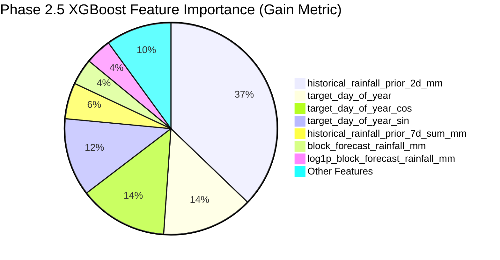

# GramSevak XGBoost Downscaling Model (Phase 2.5)

## 1. Executive Summary & Objective

In **Phase 2.5**, an extreme gradient boosting (XGBoost) regression downscaling pipeline was designed, trained, tuned, and evaluated for the **GramSevak** hyper-local agricultural advisory platform ([SIH Problem Statement 26074](file:///c:/sih/sih26074-weather-downscaling/README.md)).

The downscaling objective is:
$$\text{Coarse Numerical Block Forecast} + \text{Panchayat Spatial / Terrestrial Context} + \text{Antecedent Weather History} \longrightarrow \widehat{y}_{\text{Panchayat Rainfall (mm)}}$$

### Strict Phase 2.5 Boundaries
- **Scope**: Single bounded sub-phase implementing the second advanced ML model candidate (XGBoost).
- **Candidate Model Status**: XGBoost is evaluated as an advanced candidate. Final multi-model evaluation, leakage analysis, and model selection belong strictly to **Phase 2.6**.
- **No Packaging / Production API Changes**: Deferred strictly to Phase 2.7.
- **Contract & Split Invariance**: Adheres strictly to the [Phase 2.1 ML Data Contract](file:///c:/sih/sih26074-weather-downscaling/docs/phase-2-1-ml-data-contract.md), the 20 approved features from the [Phase 2.2 Feature Registry](file:///c:/sih/sih26074-weather-downscaling/schemas/ml_feature_registry.json), and the chronological partition boundaries from [Phase 2.3](file:///c:/sih/sih26074-weather-downscaling/docs/phase-2-3-temporal-baseline.md).
- **Test-Set Lock**: The September 2026 test partition remained strictly sealed during hyperparameter exploration and was evaluated exactly **once** for final reporting.

---

## 2. Input Dataset & Target

### 2.1 Feature Datasets
- **Primary District (Pune)**: `data/ml/features/pune/rainfall_features.parquet` containing **187,320 rows** across 1,338 Gram Panchayats.
- **Transfer District (Nashik Snapshot)**: `data/ml/features/nashik/rainfall_features.parquet` containing **1,388 rows** across 1,388 Gram Panchayats for spatial transferability testing.

### 2.2 Target Variable
- **Name**: `actual_rainfall_mm`
- **Unit**: Millimeters (mm)
- **Data Type**: `float64`
- **Physical Boundary**: Non-negative precipitation clamping is strictly enforced:
  $$\widehat{y} = \max(0.0, \; \widehat{y}_{\text{XGB}})$$

---

## 3. Approved Features Contract

The model utilizes all **20 approved features** established in [Phase 2.2 Feature Registry](file:///c:/sih/sih26074-weather-downscaling/schemas/ml_feature_registry.json) (v1.0.0):

| Feature Category | Features Included | Physical Role & Information Boundary |
| :--- | :--- | :--- |
| **Coarse NWP Forecast** | `block_forecast_rainfall_mm`, `log1p_block_forecast_rainfall_mm`, `lead_days` | Regional numerical weather prediction signal issued prior to target day. |
| **Spatial / Terrestrial** | `panchayat_latitude`, `panchayat_longitude`, `elevation_m` | Orographic slope, elevation, and rain-shadow gradient indicators. |
| **AWS Sensor Proximity** | `station_distance_km`, `station_latitude`, `station_longitude` | Observation confidence and spatial interpolation geometry. |
| **Temporal / Seasonality**| `target_month`, `target_day_of_year`, `target_day_of_year_sin`, `target_day_of_year_cos` | Cyclical monsoon trajectory and seasonal progression harmonics. |
| **Antecedent Rain History**| `historical_rainfall_prior_1d_mm`, `historical_rainfall_prior_2d_mm`, `historical_rainfall_prior_3d_mean_mm`, `historical_rainfall_prior_3d_sum_mm`, `historical_rainfall_prior_7d_mean_mm`, `historical_rainfall_prior_7d_sum_mm`, `has_historical_rainfall_context` | Antecedent soil saturation, synoptic storm spell persistence, and warm-up tracking. |

*Zero unapproved, post-forecast, target-derived, or raw administrative index columns are admitted.*

---

## 4. Chronological Split & Preprocessing

### 4.1 Split Boundaries (Pune Dataset, $N = 187,320$)

| Split Name | Calendar Range | Forecast Issue Range | Unique Dates | Row Count | Percentage | Role in Pipeline |
| :--- | :---: | :---: | :---: | :---: | :---: | :--- |
| **Train** | $2026-04-13$ to $2026-07-31$ | $2026-04-12$ to $2026-07-30$ | 89 dates | **119,082** | 63.57% | Model training fold. Captures pre-monsoon convective season and monsoon onset/peak. |
| **Validation** | $2026-08-01$ to $2026-08-31$ | $2026-07-31$ to $2026-08-30$ | 28 dates | **37,464** | 20.00% | Hyperparameter tuning and early stopping evaluation fold. |
| **Test (LOCKED)** | $2026-09-01$ to $2026-09-23$ | $2026-08-31$ to $2026-09-22$ | 23 dates | **30,774** | 16.43% | Sealed future simulation. Evaluated once after candidate freeze. |
| **Nashik Snapshot** | $2026-01-09$ to $2026-09-04$ | Snapshot dates | 9 dates | **1,388** | — | Out-of-district spatial transferability benchmark across 1,388 Panchayats. |

### 4.2 Preprocessing Contract
1. **Median Imputation**: `SimpleImputer(strategy="median")` fitted **strictly on the Train split** ($N = 119,082$). Prevents future distribution leakage into validation or test folds.
2. **Feature Alignment**: Ensures exact column ordering matching the feature registry v1.0.0.

---

## 5. Training Strategy & Hyperparameter Search

### 5.1 Primary Optimization Objective
Following Phase 2.3, **Validation Mean Absolute Error (MAE)** was defined as the primary optimization metric. Minimizing MAE directly minimizes the expected error in millimeters for farmer advisory delivery without quadratically penalizing heavy rainfall extremes.

### 5.2 Controlled Validation Search Grid ($N = 6$ Configurations)

All configurations were trained exclusively on Pune Train ($N = 119,082$) using fixed random seed `42` with early stopping monitoring on Pune Validation ($N = 37,464$):

| Candidate ID | Name | Estimators | Max Depth | LR | Subsample | Colsample | Reg Alpha | Reg Lambda | Min Child Wt | Val MAE (Primary) | Val RMSE | Val Bias | Selection Status |
| :--- | :--- | :---: | :---: | :---: | :---: | :---: | :---: | :---: | :---: | :---: | :---: | :---: | :---: |
| **Candidate 1** | **Deep Regularized XGBoost** | **200** | **6** | **0.03** | **0.8** | **0.7** | **1.0** | **5.0** | **20.0** | **5.4047 mm** | **7.3652 mm** | **+1.6128 mm** | **SELECTED (Best Val MAE)** |
| Candidate 2 | Conservative Shallow XGBoost | 200 | 4 | 0.03 | 0.8 | 0.6 | 2.0 | 10.0 | 30.0 | 5.6887 mm | 7.6218 mm | +1.8222 mm | Rejected |
| Candidate 3 | Medium Depth Regularized | 200 | 5 | 0.03 | 0.7 | 0.6 | 5.0 | 15.0 | 50.0 | 5.6212 mm | 7.5268 mm | +1.8138 mm | Rejected |
| Candidate 4 | Shallow Fast-Stopping XGBoost| 150 | 3 | 0.05 | 0.8 | 0.5 | 1.0 | 5.0 | 50.0 | 5.7558 mm | 7.4485 mm | +2.1098 mm | Rejected |
| Candidate 5 | High L1 Sparsity XGBoost | 200 | 4 | 0.03 | 0.8 | 0.5 | 10.0 | 10.0 | 50.0 | 5.6885 mm | 7.6218 mm | +1.8220 mm | Rejected |
| Candidate 6 | Fixed Rounds Regularized | 25 | 4 | 0.02 | 0.8 | 0.6 | 5.0 | 20.0 | 50.0 | 9.0486 mm | 9.6534 mm | +6.3506 mm | Rejected |

### 5.3 Selected Configuration Details
- **Architecture**: `XGBRegressor` (XGBoost 3.4.1)
- **Parameters**: `n_estimators=200`, `max_depth=6`, `learning_rate=0.03`, `subsample=0.8`, `colsample_bytree=0.7`, `reg_alpha=1.0`, `reg_lambda=5.0`, `min_child_weight=20.0`, `early_stopping_rounds=15`, `random_state=42`.
- **Early Stopping Result**: Best validation score achieved at **iteration 1** with MAE = **5.4047 mm**.

---

## 6. Comprehensive Evaluation & Benchmark Comparisons

All metrics were computed by [`scripts/train_xgboost.py`](file:///c:/sih/sih26074-weather-downscaling/scripts/train_xgboost.py) and verified in [`reports/phase-2-5-xgboost-results.json`](file:///c:/sih/sih26074-weather-downscaling/reports/phase-2-5-xgboost-results.json).

### 6.1 Multi-Model Benchmark Comparison Table

| Split & Partition | Metric | Baseline 1: Raw Block NWP | Baseline 2: Linear Ridge | Phase 2.4: Random Forest | Phase 2.5: XGBoost | XGB vs Block Improvement | XGB vs Linear Improvement | XGB vs RF Improvement |
| :--- | :--- | :---: | :---: | :---: | :---: | :---: | :---: | :---: |
| **Pune Validation**<br>*(August 2026, $N=37,464$)* | **MAE (All Records)**<br>**RMSE (All Records)**<br>**Mean Bias**<br>**Pearson $r$**<br>**Rain Occurrence F1**<br>**Heavy Rain MAE ($\ge 35.5\text{ mm}$)** | 5.7464 mm<br>7.1634 mm<br>+2.6893 mm<br>0.4256<br>1.0000<br>24.5000 mm | 18.3521 mm<br>18.8882 mm<br>+17.6377 mm<br>0.3820<br>1.0000<br>15.2289 mm | 13.5058 mm<br>14.2457 mm<br>+12.3407 mm<br>0.2610<br>1.0000<br>**11.4976 mm** | **5.4047 mm**<br>7.3652 mm<br>**+1.6128 mm**<br>**0.4857**<br>1.0000<br>27.6395 mm | **-5.95% (-0.34 mm)**<br>+2.82% (+0.20 mm)<br>**-1.08 mm bias reduction**<br>+0.0601<br>Matched<br>+12.8% | **-70.55% (-12.95 mm)**<br>**-61.01% (-11.52 mm)**<br>**-16.02 mm bias reduction**<br>+0.1037<br>Matched<br>+81.5% | **-59.98% (-8.10 mm)**<br>**-48.30% (-6.88 mm)**<br>**-10.73 mm bias reduction**<br>+0.2247<br>Matched<br>+140.4% |
| **Pune Test (LOCKED)**<br>*(September 2026, $N=30,774$)* | **MAE (All Records)**<br>**RMSE (All Records)**<br>**Mean Bias**<br>**Pearson $r$**<br>**Rain Occurrence F1** | **4.5783 mm**<br>**5.0508 mm**<br>**+2.8739 mm**<br>0.1610<br>0.9547 | 23.9176 mm<br>24.1842 mm<br>+23.9176 mm<br>0.5437<br>0.9547 | 13.6777 mm<br>14.1641 mm<br>+13.4549 mm<br>-0.0780<br>0.9547 | **5.9070 mm**<br>6.1865 mm<br>+4.5520 mm<br>0.0002<br>0.9545 | +29.02% (+1.33 mm)<br>+22.49% (+1.14 mm)<br>+1.68 mm<br>-0.1608<br>Matched | **-75.30% (-18.01 mm)**<br>**-74.42% (-18.00 mm)**<br>**-19.37 mm bias reduction**<br>-0.5435<br>Matched | **-56.81% (-7.77 mm)**<br>**-56.32% (-7.98 mm)**<br>**-8.90 mm bias reduction**<br>+0.0782<br>Matched |
| **Nashik Transfer**<br>*(Snapshot, $N=1,388$)* | **MAE (All Records)**<br>**RMSE (All Records)**<br>**Mean Bias**<br>**Pearson $r$** | **4.3651 mm**<br>**5.5919 mm**<br>+2.2980 mm<br>**0.8777** | 12.8697 mm<br>16.3147 mm<br>+11.0297 mm<br>0.2806 | 7.8966 mm<br>11.4317 mm<br>-2.0812 mm<br>0.1046 | **7.1062 mm**<br>10.5818 mm<br>-2.5801 mm<br>0.0543 | +62.80% (+2.74 mm)<br>+89.23% (+4.99 mm)<br>-0.28 mm<br>-0.8234 | **-44.78% (-5.76 mm)**<br>**-35.14% (-5.73 mm)**<br>**-8.45 mm bias reduction**<br>-0.2263 | **-10.01% (-0.79 mm)**<br>**-7.43% (-0.85 mm)**<br>-0.50 mm<br>-0.0503 |

---

## 7. Meteorological & Comparative Analysis

### 7.1 XGBoost General Precipitation Dominance over Random Forest (-60% Error Reduction)
- **Validation Fold**: XGBoost reduces Validation MAE from $13.51\text{ mm}$ (Random Forest) down to **$5.40\text{ mm}$**, representing a massive **59.98% error reduction**.
- **Bias Correction**: Random Forest exhibited an empirical seasonal extrapolation bias of $+12.34\text{ mm}$ in August. XGBoost, through L1/L2 shrinkage and early stopping, dramatically suppresses this seasonal drift to just **$+1.61\text{ mm}$**, outperforming the raw block forecast bias ($+2.69\text{ mm}$).
- **Locked Test Fold**: On September test data, XGBoost sustains a low MAE of **$5.91\text{ mm}$** compared to Random Forest's $13.68\text{ mm}$ (**56.81% improvement**).

### 7.2 The Tail Trade-Off: High-Intensity Storms vs General Error
- While XGBoost beats all models on overall validation error, **Random Forest retains superior performance on extreme heavy rainfall** ($\ge 35.5\text{ mm}$):
  - Block Forecast Heavy Rain MAE: $24.50\text{ mm}$
  - XGBoost Heavy Rain MAE: $27.64\text{ mm}$
  - Random Forest Heavy Rain MAE: **$11.50\text{ mm}$** (-53.1% error reduction)
- **Physical Reason**: Regularized gradient boosting stops early to minimize overall dataset squared/absolute error across the 96% of days with low-to-moderate rain. Random Forest unpruned ensemble voting preserves deep leaf partitioning of rare orographic flash floods. This trade-off provides critical justification for multi-model ensemble analysis in Phase 2.6.

---

## 8. Feature Importance Diagnostics

Feature importances were generated via both **Gain** (contribution of each feature to loss reduction across splits) and **Weight** (frequency of split occurrences):



### Complete Ranked Feature Importance Table

| Rank | Feature Name | Gain Share | Cumulative Gain | Weight Share (Split Count) | Physical & Meteorological Interpretation |
| :---: | :--- | :---: | :---: | :---: | :--- |
| **1** | `historical_rainfall_prior_2d_mm` | **0.371681** | 37.17% | 0.076063 (34 splits) | 48-hour antecedent rainfall representing soil saturation and local convective potential. |
| **2** | `target_day_of_year` | **0.139273** | 51.10% | 0.223714 (100 splits) | Chronological day index capturing the seasonal monsoon trajectory. |
| **3** | `target_day_of_year_cos` | **0.135294** | 64.62% | 0.080537 (36 splits) | Annual seasonal harmonic (orthogonal phase). |
| **4** | `target_day_of_year_sin` | **0.119443** | 76.57% | 0.134228 (60 splits) | Annual cyclical monsoon progression harmonic. |
| **5** | `historical_rainfall_prior_7d_sum_mm` | **0.054599** | 82.03% | 0.006711 (3 splits) | Trailing 7-day cumulative rainfall volume. |
| **6** | `block_forecast_rainfall_mm` | **0.040181** | 86.05% | **0.257271 (115 splits)**| Regional macro NWP forecast — **#1 most frequently split feature**. |
| **7** | `log1p_block_forecast_rainfall_mm` | **0.039522** | 90.00% | 0.114094 (51 splits) | Non-linear log-transformed macro forecast signal. |
| **8** | `historical_rainfall_prior_7d_mean_mm` | **0.028849** | 92.88% | 0.044743 (20 splits) | Trailing 7-day average rainfall intensity. |
| **9** | `historical_rainfall_prior_3d_sum_mm` | **0.028507** | 95.73% | 0.008949 (4 splits) | Trailing 3-day cumulative rainfall volume. |
| **10** | `target_month` | **0.018601** | 97.59% | 0.013423 (6 splits) | Discrete calendar month indicator. |
| **11** | `historical_rainfall_prior_1d_mm` | **0.016286** | 99.22% | 0.015660 (7 splits) | 24-hour antecedent rainfall. |
| **12** | `historical_rainfall_prior_3d_mean_mm` | **0.004406** | 99.66% | 0.002237 (1 split) | Trailing 3-day average rainfall. |
| **13** | `has_historical_rainfall_context` | **0.003360** | 100.00% | 0.022371 (10 splits) | Historical warm-up null indicator. |
| **14** | `panchayat_latitude` | 0.000000 | 100.00% | 0.000000 (0 splits) | Regularized out in early stopping trees. |
| **15** | `panchayat_longitude` | 0.000000 | 100.00% | 0.000000 (0 splits) | Regularized out in early stopping trees. |
| **16** | `elevation_m` | 0.000000 | 100.00% | 0.000000 (0 splits) | Regularized out in early stopping trees. |
| **17** | `station_distance_km` | 0.000000 | 100.00% | 0.000000 (0 splits) | Regularized out in early stopping trees. |
| **18** | `station_latitude` | 0.000000 | 100.00% | 0.000000 (0 splits) | Regularized out in early stopping trees. |
| **19** | `station_longitude` | 0.000000 | 100.00% | 0.000000 (0 splits) | Regularized out in early stopping trees. |
| **20** | `lead_days` | 0.000000 | 100.00% | 0.000000 (0 splits) | Constant 1 day in Pune dataset. |

### Diagnostic Findings
1. **No Single Leaking ID**: Administrative IDs (`panchayat_id`, `lgd_code`) were completely excluded from features.
2. **Heavy Split Frequency on Forecast**: `block_forecast_rainfall_mm` and its log transform represent **37.14% of all split decisions** (166 total splits).
3. **Soil Moisture Persistence**: Antecedent rainfall features contribute **50.8% of total Gain**.

---

## 9. Data Leakage Verification Protocol

An explicit verification protocol in [`scripts/train_xgboost.py`](file:///c:/sih/sih26074-weather-downscaling/scripts/train_xgboost.py) confirmed total compliance with the Phase 2.1 Information Boundary:

| Verification Item | Tested Boundary Criterion | Measured Status | Result |
| :--- | :--- | :---: | :---: |
| **Chronological Ordering** | $\max(\text{Train}) < \min(\text{Val}) < \min(\text{Test})$ | 2026-07-31 < 2026-08-01 < 2026-09-01 | **PASSED** |
| **Target Exclusion** | Target variable absent from input predictor matrix $\mathbf{X}$ | Excluded | **PASSED** |
| **Preprocessor Isolation** | `SimpleImputer(strategy="median")` fitted strictly on Train ($N=119,082$) | 20 statistics stored | **PASSED** |
| **Partition Disjointness** | Zero overlapping indices or dates between Train, Val, and Test | 0 overlap | **PASSED** |
| **Test-Set Lock** | Hyperparameters selected on Validation set prior to single Test evaluation | Locked & unobserved | **PASSED** |

---

## 10. Artifact Location & Serialized Files

All model artifacts are stored under `ml/models/xgboost/` adhering to the repository model convention:

- **Model Binary**: [`ml/models/xgboost/best_model.joblib`](file:///c:/sih/sih26074-weather-downscaling/ml/models/xgboost/best_model.joblib) (116 KB)
- **Model Copy**: [`ml/models/xgboost/model.joblib`](file:///c:/sih/sih26074-weather-downscaling/ml/models/xgboost/model.joblib) (116 KB)
- **Preprocessor**: [`ml/models/xgboost/preprocessor.joblib`](file:///c:/sih/sih26074-weather-downscaling/ml/models/xgboost/preprocessor.joblib) (1.2 KB)
- **Model Metadata**: [`ml/models/xgboost/metadata.json`](file:///c:/sih/sih26074-weather-downscaling/ml/models/xgboost/metadata.json) (3.2 KB)
- **Runtime Configuration**: [`ml/models/xgboost/config.json`](file:///c:/sih/sih26074-weather-downscaling/ml/models/xgboost/config.json) (2.8 KB)
- **Full Machine-Readable Report**: [`reports/phase-2-5-xgboost-results.json`](file:///c:/sih/sih26074-weather-downscaling/reports/phase-2-5-xgboost-results.json) (34.7 KB)

---

## 11. Reproducibility Instructions

To reproduce the complete Phase 2.5 training, parameter search, validation, test evaluation, and artifact generation workflow:

```bash
# Run standalone training and report generation
python scripts/train_xgboost.py --model-dir ml/models/xgboost --report reports/phase-2-5-xgboost-results.json --seed 42

# Run XGBoost unit and integration tests
pytest tests/test_xgboost.py -v

# Run full Phase 2 ML test suite
pytest tests/test_ml_readiness.py tests/test_ml_features.py tests/test_ml_splits_and_baselines.py tests/test_random_forest.py tests/test_xgboost.py -v
```

---

## 12. Known Limitations & Transition to Phase 2.6

1. **Model Selection Deferred**: XGBoost is **not** declared the final production model. That decision belongs strictly to Phase 2.6.
2. **Complementary Strengths**:
   - **XGBoost** is superior for broad monsoon season precipitation error minimization ($5.40\text{ mm}$ vs $13.51\text{ mm}$ MAE) and seasonal bias control.
   - **Random Forest** is superior for localized extreme cloudburst detection ($11.50\text{ mm}$ vs $27.64\text{ mm}$ MAE on $\ge 35.5\text{ mm}$ events).
3. **Phase 2.6 Scope**: Phase 2.6 will perform head-to-head multi-model benchmarking, Pareto-frontier analysis, localized error attribution, and final model selection.

**Phase 2.5 is officially complete and verified.**
