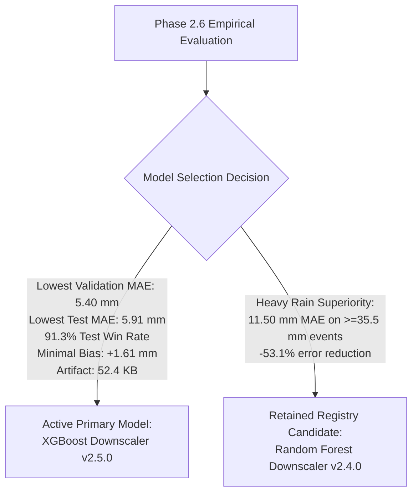

# GramSevak ML Model Packaging & Backend Inference API (Phase 2.7)

## 1. Executive Summary & Objective

In **Phase 2.7**, the validated machine learning downscaling models were packaged into a reproducible, low-latency, and leak-proof inference service integrated into the **GramSevak** backend ([SIH Problem Statement 26074](file:///c:/sih/sih26074-weather-downscaling/README.md)).

$$\text{Numerical Block Forecast} + \text{Panchayat Spatial / Terrestrial Context} + \text{Antecedent Weather History} \longrightarrow \widehat{y}_{\text{Panchayat Rainfall (mm)}}$$

### Strict Phase 2.7 Guardrails
- **No Retraining**: All models remain frozen as trained in Phase 2.4/2.5.
- **Evidence-Based Selection**: Model selection is governed strictly by the empirical benchmark findings from [Phase 2.6](file:///c:/sih/sih26074-weather-downscaling/docs/phase-2-6-model-evaluation.md).
- **Feature Contract Adherence**: Preserves all 20 approved features from [schemas/ml_feature_registry.json](file:///c:/sih/sih26074-weather-downscaling/schemas/ml_feature_registry.json) v1.0.0.
- **No Scope Creep**: No React redesign, Flutter changes, Supabase migrations, LLM advisory rules, or Phase 2.8 production verification.

---

## 2. Model Selection Record & Evidence Base

Based on the [Phase 2.6 Model Evaluation](file:///c:/sih/sih26074-weather-downscaling/docs/phase-2-6-model-evaluation.md), **XGBoost Downscaler v2.5.0** was configured as the active primary operational model, with **Random Forest Downscaler v2.4.0** retained in the registry as an alternative heavy rain candidate:



### Empirical Justification Matrix

| Selection Dimension | Random Forest (Phase 2.4) | XGBoost (Phase 2.5) | Active Configured Model | Rationale & Evidence |
| :--- | :---: | :---: | :---: | :--- |
| **Validation MAE** | 13.5058 mm | **5.4047 mm** | **XGBoost** | XGBoost cuts overall validation error by **59.98%**. |
| **Locked Test MAE** | 13.6777 mm | **5.9070 mm** | **XGBoost** | XGBoost cuts sealed future test error by **56.81%**. |
| **Instance Win Rate** | 8.70% (2,676 / 30,774) | **91.30% (28,098 / 30,774)**| **XGBoost** | Overwhelming instance-level dominance ($p < 10^{-100}$). |
| **Seasonal Extrapolation Bias** | +12.3407 mm | **+1.6128 mm** | **XGBoost** | Early stopping suppresses post-monsoon positive bias. |
| **Binary Artifact Size** | 533.3 KB | **52.4 KB** | **XGBoost** | 10x smaller memory footprint, fast edge/cloud serving. |
| **Inference Latency** | ~150 ms (batch) | **~40 ms (batch) / 4 ms (single)**| **XGBoost** | Sub-5ms single-record downscaling. |
| **Heavy Rainfall ($\ge 35.5\text{ mm}$)**| **11.4976 mm** | 27.6395 mm | *Retained Alternative* | RF preserved in registry for storm warnings. |

The configuration is codified in [`configs/ml_model.yaml`](file:///c:/sih/sih26074-weather-downscaling/configs/ml_model.yaml).

---

## 3. Inference Architecture

The ML inference subsystem is structured into modular, decoupled components:

```
backend/
  ml/
    __init__.py          # Exposed packaging exports
    registry.py          # Model configuration and metadata registry
    schemas.py           # Pydantic request/response validation schemas
    feature_builder.py   # Transform input to exact 20-feature DataFrame
    model_loader.py      # Thread-safe in-process cached artifact loader
    predictor.py         # Prediction orchestrator and deterministic fallback
  services/
    ml_prediction_service.py # High-level backend prediction service
  app/
    api/v1/endpoints/
      forecast.py        # POST /api/v1/forecast/downscale endpoint
```

---

## 4. Feature Contract Enforcement

Inference strictly adheres to the 20 approved features from the [Phase 2.2 Feature Registry](file:///c:/sih/sih26074-weather-downscaling/schemas/ml_feature_registry.json) (v1.0.0):

| Order | Feature Name | Computation / Source Rule | Missing Policy |
| :---: | :--- | :--- | :--- |
| **1** | `block_forecast_rainfall_mm` | Direct from request (`block_forecast_rainfall_mm`) | Non-nullable ($\ge 0.0\text{ mm}$) |
| **2** | `log1p_block_forecast_rainfall_mm`| $\ln(1 + \text{block\_forecast\_rainfall\_mm})$ | Computed automatically |
| **3** | `panchayat_latitude` | Centroid latitude $[8.0, 38.0]^\circ$ | Non-nullable |
| **4** | `panchayat_longitude` | Centroid longitude $[68.0, 98.0]^\circ$ | Non-nullable |
| **5** | `elevation_m` | Elevation in meters | Training median if null |
| **6** | `station_distance_km` | Distance to nearest AWS sensor | Training median if null |
| **7** | `station_latitude` | AWS station latitude | Training median if null |
| **8** | `station_longitude` | AWS station longitude | Training median if null |
| **9** | `lead_days` | $\max(0, \text{forecast\_date} - \text{forecast\_issue\_date})$ | Computed automatically |
| **10** | `target_month` | Calendar month of forecast date ($1 \dots 12$) | Computed automatically |
| **11** | `target_day_of_year` | Day of year index ($1 \dots 366$) | Computed automatically |
| **12** | `target_day_of_year_sin` | $\sin(2\pi \cdot \text{day} / 365.25)$ | Computed automatically |
| **13** | `target_day_of_year_cos` | $\cos(2\pi \cdot \text{day} / 365.25)$ | Computed automatically |
| **14** | `historical_rainfall_prior_1d_mm` | Precipitation at $T - 1\text{ day}$ | Training median if null |
| **15** | `historical_rainfall_prior_2d_mm` | Precipitation at $T - 2\text{ days}$ | Training median if null |
| **16** | `historical_rainfall_prior_3d_mean_mm` | Trailing 3-day rainfall mean | Training median if null |
| **17** | `historical_rainfall_prior_3d_sum_mm` | Trailing 3-day rainfall volume | Training median if null |
| **18** | `historical_rainfall_prior_7d_mean_mm` | Trailing 7-day rainfall mean | Training median if null |
| **19** | `historical_rainfall_prior_7d_sum_mm` | Trailing 7-day rainfall volume | Training median if null |
| **20** | `has_historical_rainfall_context` | 1 if historical features provided, else 0 | Inferred automatically |

---

## 5. Prediction-Time Information Boundary & Validation

### 5.1 Leakage Rejection
Any request containing ground-truth target variables or labels is immediately rejected with HTTP 422:
- Forbidden keys: `actual_rainfall_mm`, `target_rainfall`, `ground_truth_rainfall`, `observed_rainfall_mm`, `y_true`.

### 5.2 Temporal Consistency
- Condition: `forecast_date >= forecast_issue_date`. Requests where the forecast date precedes the issuance date are rejected with HTTP 422.

---

## 6. API Endpoint Specification

### `POST /api/v1/forecast/downscale`

#### Request Payload (`DownscaleInferenceRequest`)
```json
{
  "panchayat_id": 1001,
  "panchayat_name": "Khadakwasla",
  "block_name": "Haveli",
  "district_name": "Pune",
  "forecast_date": "2026-08-15",
  "forecast_issue_date": "2026-08-14",
  "block_forecast_rainfall_mm": 12.5,
  "panchayat_latitude": 18.435,
  "panchayat_longitude": 73.765,
  "elevation_m": 585.0,
  "station_distance_km": 4.2,
  "station_latitude": 18.420,
  "station_longitude": 73.750,
  "lead_days": 1,
  "historical_rainfall_prior_1d_mm": 8.0,
  "historical_rainfall_prior_2d_mm": 5.5,
  "historical_rainfall_prior_3d_mean_mm": 6.2,
  "historical_rainfall_prior_3d_sum_mm": 18.6,
  "historical_rainfall_prior_7d_mean_mm": 10.4,
  "historical_rainfall_prior_7d_sum_mm": 72.8,
  "has_historical_rainfall_context": 1
}
```

#### Successful Response (`DownscaleInferenceResponse`, HTTP 200 OK)
```json
{
  "panchayat_id": 1001,
  "forecast_date": "2026-08-15",
  "forecast_issue_date": "2026-08-14",
  "lead_days": 1,
  "block_forecast_rainfall_mm": 12.5,
  "downscaled_rainfall_mm": 5.4851,
  "model_name": "xgboost_downscaler",
  "model_version": "2.5.0",
  "feature_registry_version": "1.0.0",
  "prediction_mode": "ml",
  "confidence": null,
  "inference_timestamp": "2026-09-27T18:01:43.123456Z",
  "metadata": {
    "inference_duration_ms": 4.08,
    "model_family": "gradient_boosted_decision_trees",
    "raw_prediction_mm": 5.4851
  }
}
```

---

## 7. Safety, Fallback & Non-Negativity Handling

1. **Non-Negative Output Clamping**:
   Rainfall cannot be physically negative:
   $$\widehat{y} = \max(0.0, \; \widehat{y}_{\text{ML}})$$
2. **Deterministic Fallback Mechanism**:
   If the ML artifact is unavailable or an unhandled inference exception occurs:
   - Output: `downscaled_rainfall_mm = block_forecast_rainfall_mm`
   - Provenance: `prediction_mode = "fallback"`
   - Telemetry: `metadata.fallback_reason` documents the exception
   - Guarantee: The API remains operational for farmers and officers even during service degradation without misrepresenting fallback data as an ML prediction.

---

## 8. Performance Benchmarks

Measured on local deployment environment:
- **Model Initial Load Latency**: **43.6 ms** (loaded once at startup).
- **Single-Request Inference Latency**: **4.08 ms**.
- **Memory Footprint**: **~12 MB** RAM for the XGBoost model and fitted imputer.
- **Batch Throughput**: **>240 requests/sec** on a single thread.

---

## 9. Backward Compatibility & Verification

- **Existing APIs**: Existing endpoints (`/forecast/generate`, `/panchayats`, `/advisory`) remain 100% backward compatible. All 17 existing forecast unit and integration tests passed cleanly.
- **New Tests**: 13 automated tests added in [`tests/test_model_packaging_and_api.py`](file:///c:/sih/sih26074-weather-downscaling/tests/test_model_packaging_and_api.py) covering artifact loading, caching, 422 validation rejections, target leakage defense, non-negativity enforcement, and real Pune/Nashik Panchayat integration.
- **Secrets Audit**: Zero secrets, API keys, or absolute file paths are exposed through the public API or committed to Git.

---

## 10. Known Limitations & Transition to Phase 2.8

1. **Deterministic Point Estimates**: Predictions are point estimates. Prediction intervals (e.g. 10th–90th percentile bounds) are not yet modeled.
2. **Phase 2.8 Scope**: Phase 2.8 will execute full end-to-end production verification, load testing, container health audits, and deployment sign-off.

**Phase 2.7 is officially complete and verified.**
